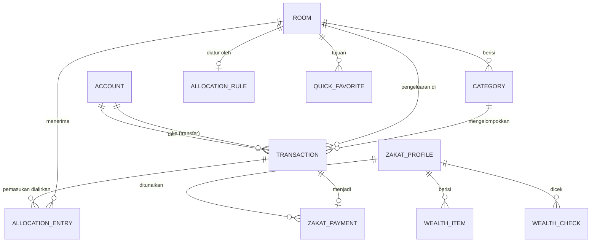

# Rizqflow — Model data dan skema penyimpanan

Rancangan model data dan skema Room (2026-09-21). Ini pengganti bagian "Draft model data" di [konsep.md](konsep.md). Keputusan yang saya usulkan ditandai **Usulan**; yang sudah diputuskan pemilik disebut jelas.

Sumber rancangan: layar dan flow di [ui-flow.md](ui-flow.md), prototipe klik, kode domain yang sudah ada (`Money`, alokasi, haul), dan **pola data nyata** dari Transaksi Harian di Ruang Finansial (lihat "Pelajaran dari data nyata").

## Prinsip

1. **Uang = bilangan bulat satuan terkecil** (`Long`) plus kode mata uang. Tidak ada kolom desimal atau floating point.
2. **Yang bisa dihitung tidak disimpan.** Saldo akun, jatah dan terpakai per ruang per bulan, status ruang, dan status haul selalu diturunkan dari transaksi; menyimpannya hanya membuka celah data tidak sinkron.
3. **Sejarah tidak ikut berubah saat aturan berubah.** Setiap pemasukan menyimpan potret alokasinya (persentase dan nominal per ruang saat itu).
4. **Jumlah selalu positif; jenis menentukan arah.** Pengeluaran, pemasukan, dan transfer semuanya bernilai positif. Ini menghindari campur tanda yang terjadi di data nyata.
5. **Pengenal berupa UUID teks**, supaya backup, restore, dan sync fase 2 tidak bentrok antar-perangkat.

## Diagram

## Tabel

Kolom `id` selalu UUID teks. Tanggal disimpan sebagai `epochDay` (bilangan bulat hari sejak 1970-01-01, tanpa zona waktu); waktu kejadian sistem sebagai `epochMillis`.

### account
| Kolom | Tipe | Catatan |
|---|---|---|
| name | teks | Wajib |
| kind | teks | `CASH`, `BANK`, `EWALLET` |
| currency | teks | `IDR` untuk v1 |
| opening_balance | Long | Saldo awal (S04); bukan rezeki |
| archived | boolean | Akun berisi transaksi hanya bisa diarsipkan, tidak dihapus |
| sort_order | Int | |
| last_reconciled_on | epochDay, boleh kosong | Terakhir dicocokkan lewat S25; menggerakkan butir "Perlu perhatian" |

Saldo menurut catatan = `opening_balance` + pemasukan ke akun − pengeluaran dari akun ± transfer masuk dan keluar.

### room
| Kolom | Tipe | Catatan |
|---|---|---|
| name | teks | |
| kind | teks | `MENUNAIKAN`, `MENUMBUHKAN`, `MENCUKUPI` (menentukan arti "terpenuhi") |
| icon_key, color_slot | teks, Int | Slot 1 sampai 3 tervalidasi; ruang ke-4 dan seterusnya belum |
| sort_order | Int | **Juga prioritas**: pemutus seri pembulatan alokasi (mode persentase) dan urutan pengisian (mode lanjutan/waterfall, Pro) |
| archived | boolean | Tidak tampil di Denah dan tidak menerima alokasi baru; riwayat tetap |
| giving_mode | teks, boleh kosong | Hanya ruang Memberi: `zakat-haul-hijri` atau `percentage` |

### allocation_rule
| Kolom | Tipe | Catatan |
|---|---|---|
| room_id | FK, kunci utama | Satu aturan aktif per ruang |
| share_bp | Int | Basis point, 0 sampai 10.000; total semua ruang aktif tepat 10.000 (dijaga UI, S12). Dipakai bila mode PERCENTAGE |
| cap_amount | Long, boleh kosong (versi 2, migrasi `MIGRATION_1_2`) | Batas atas rupiah ruang untuk mode WATERFALL (Pro); kosong = tak terbatas. Independen dari `share_bp` — keduanya bisa terisi sekaligus, hanya salah satu dipakai menurut mode aktif |

**Mode aturan alokasi** (2026-09-23, docs/monetisasi.md "Aturan alokasi lanjutan"): disimpan sebagai `app_setting` kunci `allocation_mode` (`PERCENTAGE` default, atau `WATERFALL`), bukan kolom baru — cukup pakai tabel kunci/nilai generik yang sudah ada. Mode WATERFALL: ruang diisi berurutan menurut `sort_order` sampai `cap_amount`-nya, kelebihan mengalir ke ruang berikutnya (`AllocationEngine.allocateWaterfall`, murni aritmetika bulat, tanpa pembulatan). Potretnya (`allocation_entry`) tetap disimpan sebagai persentase seperti biasa lewat `AllocationEngine.impliedShares` — tidak ada kolom snapshot baru, dan perubahan nominal transaksi (S09) tetap dihitung ulang lewat mekanisme persentase yang sudah ada, bukan menjalankan ulang waterfall-nya.

### category (pos)
| Kolom | Tipe | Catatan |
|---|---|---|
| room_id | FK | |
| name | teks | |
| weight | Int, boleh kosong | Bobot relatif untuk membagi jatah ruang ke pos (Detail ruang S11); kosong = ikut jatah ruang |
| is_system | boolean | `Zakat mal` dan `Tak terlacak`: tidak bisa dihapus atau diganti nama |
| archived, sort_order | | |

### money_transaction

Entitas Transaction. Nama tabel `money_transaction` karena `TRANSACTION` kata kunci SQL.

| Kolom | Tipe | Catatan |
|---|---|---|
| kind | teks | `INCOME`, `EXPENSE`, `TRANSFER` |
| amount | Long | **Selalu positif** |
| currency | teks | |
| account_id | FK | Akun asal (pengeluaran dan transfer) atau akun tujuan (pemasukan) |
| to_account_id | FK, boleh kosong | Hanya transfer |
| room_id, category_id | FK, boleh kosong | Hanya pengeluaran; wajib untuk pengeluaran |
| income_source | teks, boleh kosong | Hanya pemasukan: Gaji, Usaha, Freelance, Lainnya |
| occurred_on | epochDay | Bulan transaksi menentukan jatah ruang bulan itu |
| note | teks, boleh kosong | |
| origin | teks | `MANUAL`, `QUICK`, `REPLY`, `CORRECTION`, `DRAFT`, `IMPORT`, `RECURRING` (transaksi berulang), `BILL` (pembayaran tagihan) |
| created_at, updated_at | epochMillis | |

Batasan: `TRANSFER` tidak punya ruang dan tidak dihitung sebagai pemasukan atau pengeluaran; `account_id` dan `to_account_id` harus berbeda. Koreksi saldo (S25) hanyalah `EXPENSE` kategori sistem `Tak terlacak` atau `INCOME` dengan `origin = CORRECTION`.

### allocation_entry
Potret alokasi satu pemasukan.

| Kolom | Tipe | Catatan |
|---|---|---|
| income_id | FK ke transaction | Hapus pemasukan menghapus entrinya |
| room_id | FK | |
| share_bp | Int | Persentase yang berlaku saat itu (termasuk hasil "Ubah sekali ini") |
| amount | Long | Hasil `AllocationEngine`; sudah termasuk sisa pembulatan |
| allocated_at | epochMillis | |

**Belum dialirkan** = nominal pemasukan − jumlah entrinya; tidak disimpan. Bila kemudian pengguna menekan Alirkan, entri baru ditambahkan dengan aturan pada saat itu. Ini menggantikan daftar `pending` di prototipe.

### quick_favorite
`name`, `amount`, `room_id`, `category_id`, `account_id`, `use_count`, `last_used_at`. Paling banyak 6 tersimpan dan tampil di S24, urut `use_count` (lalu `last_used_at`, lalu nama). Tidak ada kolom urutan manual; menambahnya butuh migrasi.

### day_check
`day` (epochDay, kunci utama): hari yang ditandai "Tidak ada" lewat notifikasi malam atau banner hari kosong.

### app_setting
`key` (kunci utama), `value` (teks). Pengingat (aktif, jam), tema, bahasa, mode Memberi, dan penanda onboarding selesai. PIN **tidak** disimpan di sini (lihat "Keamanan").

### Modul zakat (S14 sampai S17)
- **zakat_profile**: `name` (satu profil gratis; multi-profil Pro), `haul_break_policy`, `archived`. Profil pertama (Utama) dibuat otomatis saat harta pertama disimpan; profil tambahan (mis. istri, usaha) butuh Pro (2026-09-23) dan diarsipkan, bukan dihapus, supaya riwayat zakatnya tetap. Urutan profil = urutan pembuatan (rowid), tanpa kolom urutan. Profil dinilai sendiri-sendiri: harta, pemeriksaan, pembayaran, dan haulnya terpisah; harga emas (`gold_price`) dipakai bersama. Profil tanpa `wealth_check` sama sekali belum bisa dinilai (status meminta harta diisi).
- **wealth_item**: `profile_id`, `kind` (`GOLD`, `CASH_SAVINGS`, `INVESTMENT`, `RECEIVABLE`, `OTHER`, `DEDUCTION`), `label`, `value` (Long; untuk emas nilai saat dihitung), `gold_milligrams` (boleh kosong), `updated_at`.
- **gold_price**: `day`, `per_gram`, `source` (`MANUAL`, `AUTO`). Riwayat harga supaya nisab lama bisa direkonstruksi.
- **wealth_check**: `profile_id`, `day`, `net_wealth`, `nisab`. Ini persis `HaulEvent.WealthChecked` di domain; **status haul tidak disimpan**, dihitung ulang oleh `HaulTracker`.
- **zakat_payment**: `profile_id`, `day`, `transaction_id` (pengeluaran kategori `Zakat mal` di ruang Memberi). Ini `HaulEvent.ZakatPaid`.

### Sistem per peran (Pro, versi 3, 2026-09-23)
Modul opsional per ruang; ada barisnya berarti modul terpasang, dan satu ruang paling banyak punya satu peran (dijaga `RoleService`, bukan skema). Keduanya `ON DELETE CASCADE` dari `room`.
- **trader_profile**: `room_id` (kunci utama), `capital` (Long; modal trading yang diisi pengguna, bukan dihitung dari saldo), `risk_bp` (basis point modal yang boleh hilang per trade). Batas rupiahnya, `capital * risk_bp / 10.000` dibulatkan ke bawah, dihitung saat dibutuhkan (`TraderProfile.maxRiskPerTrade`), tidak disimpan.
- **dca_plan**: `room_id` (kunci utama), `amount` (Long), `day_of_month` (1 sampai 28 supaya ada di setiap bulan), `account_id`, `category_id` (kategori biasa milik ruang itu). Status bulan ini (Selesai, Jatuh tempo, Akan datang) **tidak disimpan**: dihitung dari pengeluaran di ruang dan kategori itu bulan ini (`DcaStatus`), jadi menghapus transaksinya membuat DCA jatuh tempo lagi.
- Kerugian trade dan investasi DCA tetap **pengeluaran biasa** di ruang itu (keputusan di [konsep.md](konsep.md): investasi = pengeluaran). Modul tidak menambah jenis transaksi.
- Turun paket tidak menghapus apa pun: peringatan dan pengingat berhenti, pengaturan tetap terlihat dan bisa dilepas.

### Draf tangkap otomatis (v1.1)
Tabel `capture_draft` ditambah lewat migrasi saat fitur dibuat; tidak dirancang sekarang.

## Indeks

`transaction(occurred_on)`, `transaction(account_id, occurred_on)`, `transaction(room_id, occurred_on)`, `allocation_entry(income_id)`, `allocation_entry(room_id)`, `category(room_id)`, `wealth_check(profile_id, day)`.

## Kueri yang harus cepat

| Kebutuhan | Dari |
|---|---|
| Jatah ruang bulan ini | jumlah `allocation_entry.amount` untuk ruang itu, pemasukan bulan itu |
| Terpakai bulan ini | jumlah pengeluaran ruang itu bulan itu |
| Status ruang | dihitung di domain dari jatah, terpakai, dan tipe ruang (ambang 85% untuk Mencukupi) |
| Saldo akun | `opening_balance` + agregat transaksi |
| Hari kosong | tanggal kemarin tanpa pengeluaran dan tanpa `day_check` |

Volume data kecil (sekitar 3 transaksi per hari, ribuan per tahun), jadi agregat langsung dengan indeks sudah cukup; tidak perlu tabel ringkasan.

## Pelajaran dari data nyata

Pola dari 239 baris Transaksi Harian (27 Juni sampai 4 September 2026), sudah memengaruhi rancangan di atas. Isi datanya tidak disalin ke repo.

| Temuan | Dampak |
|---|---|
| Transfer antar-akun dicatat sebagai **dua baris** ("Transfer to BCA (Out)" pengeluaran dan "(In)" pemasukan): 54 dari 239 baris, setara 27 transfer | Ada jenis `TRANSFER` tersendiri (tab Transfer di S06). Pemasukan hasil transfer **tidak boleh** dialirkan ke ruang sebagai rezeki. Impor CSV harus menyatukan pasangannya |
| Tanda nominal **tidak konsisten**: dari 209 pengeluaran, 195 bertanda negatif dan 14 positif | Jumlah selalu positif, jenis menentukan arah; impor memakai nilai mutlak |
| 42 deskripsi berhierarki "Transportation > BBM", dan bahasanya campur Indonesia dan Inggris | Impor memecah menjadi kategori dan sub; nama kategori bebas |
| 23 baris punya catatan, sebagian panjang (referensi bank, jam) | Tidak ada batas pendek untuk `note`; tampilan memotong dengan elipsis |
| Nominal dari Rp 490 sampai Rp 25.783.000; gaji tidak bulat (Rp 17.805.137) | Pembulatan alokasi nyata terpakai; tampilan harus muat angka 8 digit di teks 200% |
| 58 dari 70 hari punya catatan, rata-rata 3 sampai 4 pengeluaran kecil per hari yang tercatat (kopi, rokok, makan); 12 hari kosong, termasuk rentang 3 hari berturut-turut | Menguatkan Catat kilat dan petunjuk hari kosong |
| Banyak akun (BCA, Bank Mega, tunai) | Akun dan transfer bukan fitur tambahan, melainkan inti |

## Migrasi dan versi

- `exportSchema = true`; berkas skema JSON disimpan di `data/schemas/` dan **masuk git**, supaya setiap versi skema bisa diuji.
- Skema versi 1 adalah tabel di atas. Setiap perubahan naik versi dan wajib punya tes `MigrationTestHelper` yang menjalankan migrasi dari versi sebelumnya dan memeriksa data.
- **Dilarang** `fallbackToDestructiveMigration`: data keuangan tidak boleh hilang diam-diam.
- Migrasi otomatis Room dipakai untuk perubahan sederhana (tambah kolom atau tabel); yang lain ditulis manual.
- **Format backup berversi terpisah dari skema Room.** Backup berupa dokumen JSON (dengan `formatVersion`) yang dienkripsi AES-256-GCM. Restore membaca dokumen itu lewat repositori, jadi berkas lama tetap terbaca setelah skema berubah.

## Keamanan

- PIN tidak disimpan sebagai teks: hanya hash berkunci (PBKDF2 dengan salt) di penyimpanan aman Android (Keystore).
- `allowBackup=false`; database tanpa SQLCipher untuk v1 (lihat konsep.md).

## Data per akun (diputuskan 2026-09-21)

Satu database per akun. Nama berkas: `rizqflow-<32 hex pertama SHA-256 dari pengenal akun>.db`, jadi email tidak muncul di nama berkas dan pengenal apa pun (email, UUID, `debug`) menghasilkan nama yang aman. Berganti akun membuka berkas lain; akun yang sama selalu kembali ke berkas yang sama. Keluar tidak menghapus berkas. Skema di dalamnya sama untuk semua akun, jadi tidak ada kolom pemilik.

## Keputusan yang saya usulkan (dipakai sebagai default kerja)

Enam butir ini sudah tertanam di skema versi 1 dan di lapisan data. Pemilik belum menjawab satu per satu; bila ada yang diubah, lakukan sebelum ada data pengguna nyata (tanpa migrasi).

1. UUID teks sebagai pengenal (bukan angka berurut).
2. Tanggal transaksi sebagai `epochDay` tanpa zona waktu; bulan mengikuti kalender Masehi.
3. Tidak ada carry-over sisa jatah antar-bulan di v1: jatah dan terpakai dihitung per bulan.
4. Pemasukan yang belum sepenuhnya dialirkan tetap satu transaksi, dengan sisa turunan (bukan daftar `pending` terpisah).
5. Mata uang v1 hanya IDR; kolom `currency` sudah ada supaya multi-mata uang (Pro) tidak memerlukan migrasi bentuk.
6. Hapus transaksi berarti hapus fisik (Urungkan hidup di memori beberapa detik). Bila sync fase 2 dibuat, ditambah penanda hapus lewat migrasi.

## Lapisan data (2026-09-21)

- **Domain** (`:domain`, paket `ledger`): model (`Account`, `Room`, `Category`, `MoneyTransaction`, `AllocationEntry`), antarmuka repositori, dan layanan: `WorkspaceSetup` (onboarding S02 sampai S04), `LedgerService` (pemasukan, pengeluaran, transfer, ubah nominal pemasukan, hapus), `RuleService` (aturan alokasi harus tepat 100%, tambah ruang dengan batas paket).
- **Data** (`:data`): DAO tambahan, pemeta entity, repositori Room (`LocalWorkspaceRepository`, `LocalAccountRepository`, `LocalRoomRepository`, `LocalTransactionRepository`), dan `LocalLedger.open(context, accountId)` yang membuka database milik akun itu. Fungsi yang menulis banyak baris berjalan dalam satu transaksi database.
- **Potret alokasi** menyimpan satu baris untuk **setiap ruang yang persentasenya lebih dari nol**, termasuk yang jumlahnya 0 karena nominal kecil (Rp 1 dengan 10/30/60 menghasilkan 0, 0, 1). Persentasenya harus tersimpan supaya ubah nominal ke angka yang lebih besar bisa dihitung ulang benar.
- **Kategori sistem** dibuat saat onboarding: `Tak terlacak` di setiap ruang (Koreksi saldo mencatat selisih di ruang mana pun) dan `Zakat mal` di ruang Memberi. Ruang Memberi memakai mode `percentage` sebagai bawaan; modul zakat opsional.
- **Mengganti aturan** hanya menyentuh ruang aktif; persentase ruang terarsip dipertahankan supaya bisa dipulihkan.

## Yang belum ditulis

- Manajemen akun, kategori, favorit, dan arsip ruang (S10, S13); layanan untuk Koreksi saldo (S25) dan tunaikan zakat (S17).
- Tabel `capture_draft` (v1.1), lewat migrasi.

### Transaksi berulang (Gratis, versi 4, 2026-09-24)
- **recurring_rule**: `id`, `kind` (`INCOME`, `EXPENSE`, `TRANSFER`), `amount` (Long), `currency`, `account_id`, `to_account_id` (hanya transfer), `room_id` dan `category_id` (hanya pengeluaran), `income_source` (hanya pemasukan), `note`, `frequency` (`DAILY`, `WEEKLY`, `MONTHLY`), `start_date` (jangkar jadwal), `next_due` (kemunculan berikutnya yang belum dicatat), `end_date` (boleh kosong), `active` (false = dijeda). Keempat kunci asing `ON DELETE RESTRICT`, seperti `money_transaction`.
- **Jadwal dihitung dari `start_date`, bukan dari kemunculan sebelumnya**, jadi aturan bulanan yang mulai tanggal 31 jatuh di 28 (29) Februari lalu kembali ke 31 Maret, tidak tertinggal di 28 (`RecurrenceSchedule`).
- **Tanpa penjadwal latar belakang.** `RecurringService.runDue` dipanggil saat ruang kerja dibuka dan tiap aplikasi kembali ke depan; ia mencatat semua kemunculan dari `next_due` sampai hari ini, termasuk yang terlewat selama aplikasi tidak dibuka (paling banyak 400 per aturan per panggilan; sisanya menyusul).
- **Tidak menggandakan.** Tiap kemunculan punya pengenal transaksi tetap `rec-<id aturan>-<tanggal>`. Bila aplikasi mati setelah transaksi tersimpan tetapi sebelum `next_due` maju, panggilan berikutnya menemukan transaksinya dan hanya memajukan aturan. Transaksi yang dihapus pengguna tidak dicatat ulang karena `next_due` sudah lewat.
- Transaksi hasilnya bertanda `origin = RECURRING` dan lewat `LedgerService` yang sama dengan Catat: pemasukan dialirkan menurut aturan alokasi saat itu, dan jatah ruang serta saldo akun ikut berubah.
- Kemunculan yang gagal (akun, ruang, atau kategori sudah diarsipkan) menahan aturan itu di tempatnya dan dilaporkan; aturan lain jalan terus. Setelah diperbaiki atau dipulihkan, yang tertahan disusul. Menjeda lalu melanjutkan **tidak** mengejar yang terlewat selama dijeda.
- Aturan baru tidak boleh mulai sebelum hari ini (yang sudah lewat dicatat sendiri oleh pengguna). Menghapus aturan tidak menghapus transaksi yang sudah dicatat.

### Tagihan dan cicilan (Gratis, versi 5, 2026-09-24)
- **bill**: `id`, `name`, `amount` (Long), `currency`, `account_id`, `room_id`, `category_id` (selalu pengeluaran, jadi ketiganya wajib), `note`, `frequency` (`WEEKLY`, `MONTHLY`, atau kosong = sekali bayar), `start_date` (jangkar jadwal), `next_due` (jatuh tempo yang belum dibayar), `total_installments` (kosong = tanpa batas; hanya untuk tagihan berulang), `paid_count`, `active` (false = dijeda). Ketiga kunci asing `ON DELETE RESTRICT`.
- **Beda dari transaksi berulang:** pembayaran tagihan terjadi di luar aplikasi, jadi tagihan **tidak pernah dicatat otomatis**. `BillService.pay` dipanggil saat pengguna mengetuk Bayar: mencatat pengeluaran lewat `LedgerService` (`origin = BILL`) lalu memajukan `next_due` dan `paid_count`. Jatuh tempo boleh sudah lewat (terlambat); membayar tagihan yang terlambat memajukan **satu** jatuh tempo saja, jadi tunggakan dua bulan dibayar dua kali.
- **Tidak menggandakan.** Pengenal transaksi tetap `bill-<id tagihan>-<jatuh tempo>`; bila aplikasi mati setelah pengeluaran tersimpan tetapi sebelum tagihan maju, pembayaran berikutnya menemukan transaksinya dan hanya memajukan tagihan.
- **Nominal yang dibayar boleh berbeda** dari `amount` (listrik dan air berubah tiap bulan); `amount` tidak ikut berubah. Catatan pengeluarannya nama tagihan, ditambah "(n/total)" untuk cicilan.
- **Lunas:** tagihan sekali bayar setelah dibayar sekali; cicilan setelah `paid_count` mencapai `total_installments`. `next_due` tidak dimajukan lagi setelah lunas. Tagihan lunas tidak bisa dibayar (`BILL_FINISHED`).
- **Urungkan** (`undoPay`) menghapus pengeluarannya dan mengembalikan tagihan persis seperti sebelum dibayar.
- **Jadwal** memakai `RecurrenceSchedule` dari `start_date` seperti transaksi berulang; mengubah tanggal jatuh tempo di layar memindahkan jangkar, tanpa perubahan jangkar lama dipertahankan.
- **Pengingat** (`BillReminderService`) menumpang `ReminderWorker` harian sehingga hanya jalan bila pengingat malam aktif, seperti haul dan DCA. Tiga tahap per jatuh tempo: `APPROACHING` (1 sampai 3 hari lagi), `DUE_TODAY`, dan `OVERDUE`, masing-masing sekali. Penanda di `app_setting` (`bill_reminder_notified_<id>` = `<jatuh tempo>:<tahap>`) terikat pada jatuh temponya, jadi membayar memulai daur baru tanpa menghapus apa pun; tahap yang sudah terlewat tidak disapa mundur. Tagihan yang dijeda atau lunas tidak disapa.
- Menghapus tagihan tidak menghapus pengeluaran yang sudah tercatat.

## Status implementasi

Skema versi 1 sudah ditulis di `data/src/main/kotlin/.../data/db/` (14 entity, 4 DAO, `RizqflowDatabase`). Kueri SQL diperiksa saat kompilasi oleh Room, dan berkas skema JSON tersimpan di `data/schemas/`. Room 2.8.5 dengan KSP 2.3.12 berjalan di Gradle 9.7 dan AGP 9.4 (built-in Kotlin).

Skema naik ke **versi 2** (2026-09-23, `MIGRATION_1_2`: `allocation_rule.cap_amount` untuk aturan alokasi lanjutan). Migrasi pertama ini TIDAK diuji lewat `androidx.room:room-testing`'s `MigrationTestHelper`: pada kombinasi Room 2.8.5 + Robolectric di proyek ini, helper itu selalu melempar `IllegalArgumentException` ("driver dikonfigurasi membuka X tapi Y diminta") sebelum migrasi sempat berjalan, walau `openFactory` diberikan eksplisit — kemungkinan bug spesifik kombinasi versi ini. `MigrationTest.kt` (`:data`) sebagai gantinya membangun berkas skema versi 1 apa adanya dari `createSql`/`indices` di `1.json` (bukan menyalin tangan), lalu membukanya lewat jalur produksi sungguhan (`Room.databaseBuilder(...).addMigrations(...)`, sama seperti `LocalLedger.open`) — pola ini dipakai lagi untuk migrasi berikutnya kecuali bug Room-nya sudah diperbaiki.

Skema naik ke **versi 3** (2026-09-23, `MIGRATION_2_3`: tabel baru `trader_profile` dan `dca_plan` untuk sistem per peran). Aditif saja. `MigrationTest.kt` kini menjalankan 1 sampai 3 sekaligus, memeriksa tabel baru kosong dan bisa dipakai lewat DAO; pernyataan SQL migrasi sama dengan `createSql` di `3.json`.

Skema naik ke **versi 4** (2026-09-24, `MIGRATION_3_4`: tabel baru `recurring_rule` untuk transaksi berulang). Aditif saja. `MigrationTest.kt` kini menjalankan 1 sampai 4 sekaligus; Room sendiri memeriksa skema hasil migrasi terhadap `4.json` saat database dibuka, dan tes memastikan tabel barunya kosong dan bisa dipakai lewat DAO. Migrasi 3 ke 4 juga teruji pada database sungguhan di emulator (pasang ulang di atas data lama, tanpa crash).

Skema naik ke **versi 5** (2026-09-24, `MIGRATION_4_5`: tabel baru `bill` untuk tagihan dan cicilan). Aditif saja. `MigrationTest.kt` kini menjalankan 1 sampai 5 sekaligus; pernyataan SQL migrasi sama dengan `createSql` di `5.json`, dan tes memastikan tabelnya kosong dan bisa dipakai lewat DAO.
