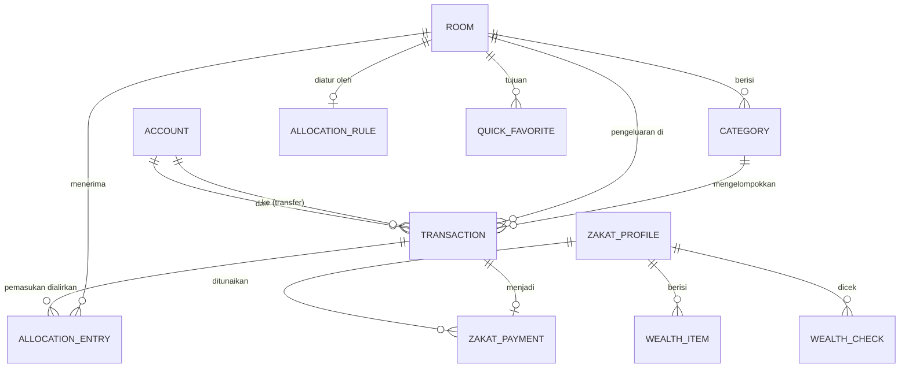

# Rizqflow — Model data dan skema penyimpanan

Rancangan model data dan skema Room (2026-09-21). Ini pengganti bagian "Draft model data" di [konsep.md](konsep.md). Keputusan yang saya usulkan ditandai **Usulan**; yang sudah diputuskan pemilik disebut jelas.

Sumber rancangan: layar dan flow di [ui-flow.md](ui-flow.md), prototipe klik, kode domain yang sudah ada (`Money`, alokasi, haul), dan **pola data nyata** dari Transaksi Harian di Ruang Finansial (lihat "Pelajaran dari data nyata").

## Prinsip

1. **Uang = bilangan bulat satuan terkecil** (`Long`) plus kode mata uang. Tidak ada kolom desimal atau floating point.
2. **Yang bisa dihitung tidak disimpan.** Saldo akun, jatah dan terpakai per ruang per bulan, status ruang, dan status haul selalu diturunkan dari transaksi; menyimpannya hanya membuka celah data tidak sinkron.
3. **Sejarah tidak ikut berubah saat aturan berubah.** Setiap pemasukan menyimpan potret alokasinya (persentase dan nominal per ruang saat itu).
4. **Jumlah selalu positif; jenis menentukan arah.** Pengeluaran, pemasukan, dan transfer semuanya bernilai positif. Ini menghindari campur tanda yang terjadi di data nyata.
5. **Pengenal berupa UUID teks**, supaya backup, restore, dan sync fase 2 tidak bentrok antar-perangkat.

## Diagram

## Tabel

Kolom `id` selalu UUID teks. Tanggal disimpan sebagai `epochDay` (bilangan bulat hari sejak 1970-01-01, tanpa zona waktu); waktu kejadian sistem sebagai `epochMillis`.

### account
| Kolom | Tipe | Catatan |
|---|---|---|
| name | teks | Wajib |
| kind | teks | `CASH`, `BANK`, `EWALLET` |
| currency | teks | `IDR` untuk v1 |
| opening_balance | Long | Saldo awal (S04); bukan rezeki |
| archived | boolean | Akun berisi transaksi hanya bisa diarsipkan, tidak dihapus |
| sort_order | Int | |
| last_reconciled_on | epochDay, boleh kosong | Terakhir dicocokkan lewat S25; menggerakkan butir "Perlu perhatian" |

Saldo menurut catatan = `opening_balance` + pemasukan ke akun − pengeluaran dari akun ± transfer masuk dan keluar.

### room
| Kolom | Tipe | Catatan |
|---|---|---|
| name | teks | |
| kind | teks | `MENUNAIKAN`, `MENUMBUHKAN`, `MENCUKUPI` (menentukan arti "terpenuhi") |
| icon_key, color_slot | teks, Int | Slot 1 sampai 3 tervalidasi; ruang ke-4 dan seterusnya belum |
| sort_order | Int | **Juga prioritas**: pemutus seri pembulatan alokasi |
| archived | boolean | Tidak tampil di Denah dan tidak menerima alokasi baru; riwayat tetap |
| giving_mode | teks, boleh kosong | Hanya ruang Memberi: `zakat-haul-hijri` atau `percentage` |

### allocation_rule
| Kolom | Tipe | Catatan |
|---|---|---|
| room_id | FK, kunci utama | Satu aturan aktif per ruang |
| share_bp | Int | Basis point, 0 sampai 10.000; total semua ruang aktif tepat 10.000 (dijaga UI, S12) |

Aturan lanjutan Pro (prioritas, batas atas, sisa mengalir) nanti menambah kolom atau tabel lewat migrasi; jangan dirancang sekarang.

### category (pos)
| Kolom | Tipe | Catatan |
|---|---|---|
| room_id | FK | |
| name | teks | |
| weight | Int, boleh kosong | Bobot relatif untuk membagi jatah ruang ke pos (Detail ruang S11); kosong = ikut jatah ruang |
| is_system | boolean | `Zakat mal` dan `Tak terlacak`: tidak bisa dihapus atau diganti nama |
| archived, sort_order | | |

### money_transaction

Entitas Transaction. Nama tabel `money_transaction` karena `TRANSACTION` kata kunci SQL.

| Kolom | Tipe | Catatan |
|---|---|---|
| kind | teks | `INCOME`, `EXPENSE`, `TRANSFER` |
| amount | Long | **Selalu positif** |
| currency | teks | |
| account_id | FK | Akun asal (pengeluaran dan transfer) atau akun tujuan (pemasukan) |
| to_account_id | FK, boleh kosong | Hanya transfer |
| room_id, category_id | FK, boleh kosong | Hanya pengeluaran; wajib untuk pengeluaran |
| income_source | teks, boleh kosong | Hanya pemasukan: Gaji, Usaha, Freelance, Lainnya |
| occurred_on | epochDay | Bulan transaksi menentukan jatah ruang bulan itu |
| note | teks, boleh kosong | |
| origin | teks | `MANUAL`, `QUICK`, `REPLY`, `CORRECTION`, `DRAFT`, `IMPORT` |
| created_at, updated_at | epochMillis | |

Batasan: `TRANSFER` tidak punya ruang dan tidak dihitung sebagai pemasukan atau pengeluaran; `account_id` dan `to_account_id` harus berbeda. Koreksi saldo (S25) hanyalah `EXPENSE` kategori sistem `Tak terlacak` atau `INCOME` dengan `origin = CORRECTION`.

### allocation_entry
Potret alokasi satu pemasukan.

| Kolom | Tipe | Catatan |
|---|---|---|
| income_id | FK ke transaction | Hapus pemasukan menghapus entrinya |
| room_id | FK | |
| share_bp | Int | Persentase yang berlaku saat itu (termasuk hasil "Ubah sekali ini") |
| amount | Long | Hasil `AllocationEngine`; sudah termasuk sisa pembulatan |
| allocated_at | epochMillis | |

**Belum dialirkan** = nominal pemasukan − jumlah entrinya; tidak disimpan. Bila kemudian pengguna menekan Alirkan, entri baru ditambahkan dengan aturan pada saat itu. Ini menggantikan daftar `pending` di prototipe.

### quick_favorite
`name`, `amount`, `room_id`, `category_id`, `account_id`, `use_count`, `last_used_at`. Paling banyak 6 tampil di S24, urut `use_count`.

### day_check
`day` (epochDay, kunci utama): hari yang ditandai "Tidak ada" lewat notifikasi malam atau banner hari kosong.

### app_setting
`key` (kunci utama), `value` (teks). Pengingat (aktif, jam), tema, bahasa, mode Memberi, dan penanda onboarding selesai. PIN **tidak** disimpan di sini (lihat "Keamanan").

### Modul zakat (S14 sampai S17)
- **zakat_profile**: `name` (satu profil gratis; multi-profil Pro), `haul_break_policy`, `archived`.
- **wealth_item**: `profile_id`, `kind` (`GOLD`, `CASH_SAVINGS`, `INVESTMENT`, `RECEIVABLE`, `OTHER`, `DEDUCTION`), `label`, `value` (Long; untuk emas nilai saat dihitung), `gold_milligrams` (boleh kosong), `updated_at`.
- **gold_price**: `day`, `per_gram`, `source` (`MANUAL`, `AUTO`). Riwayat harga supaya nisab lama bisa direkonstruksi.
- **wealth_check**: `profile_id`, `day`, `net_wealth`, `nisab`. Ini persis `HaulEvent.WealthChecked` di domain; **status haul tidak disimpan**, dihitung ulang oleh `HaulTracker`.
- **zakat_payment**: `profile_id`, `day`, `transaction_id` (pengeluaran kategori `Zakat mal` di ruang Memberi). Ini `HaulEvent.ZakatPaid`.

### Draf tangkap otomatis (v1.1)
Tabel `capture_draft` ditambah lewat migrasi saat fitur dibuat; tidak dirancang sekarang.

## Indeks

`transaction(occurred_on)`, `transaction(account_id, occurred_on)`, `transaction(room_id, occurred_on)`, `allocation_entry(income_id)`, `allocation_entry(room_id)`, `category(room_id)`, `wealth_check(profile_id, day)`.

## Kueri yang harus cepat

| Kebutuhan | Dari |
|---|---|
| Jatah ruang bulan ini | jumlah `allocation_entry.amount` untuk ruang itu, pemasukan bulan itu |
| Terpakai bulan ini | jumlah pengeluaran ruang itu bulan itu |
| Status ruang | dihitung di domain dari jatah, terpakai, dan tipe ruang (ambang 85% untuk Mencukupi) |
| Saldo akun | `opening_balance` + agregat transaksi |
| Hari kosong | tanggal kemarin tanpa pengeluaran dan tanpa `day_check` |

Volume data kecil (sekitar 3 transaksi per hari, ribuan per tahun), jadi agregat langsung dengan indeks sudah cukup; tidak perlu tabel ringkasan.

## Pelajaran dari data nyata

Pola dari 239 baris Transaksi Harian (27 Juni sampai 4 September 2026), sudah memengaruhi rancangan di atas. Isi datanya tidak disalin ke repo.

| Temuan | Dampak |
|---|---|
| Transfer antar-akun dicatat sebagai **dua baris** ("Transfer to BCA (Out)" pengeluaran dan "(In)" pemasukan) | Ada jenis `TRANSFER` tersendiri (tab Transfer di S06). Pemasukan hasil transfer **tidak boleh** dialirkan ke ruang sebagai rezeki. Impor CSV harus menyatukan pasangannya |
| Tanda nominal **tidak konsisten**: pengeluaran ada yang positif, ada yang negatif | Jumlah selalu positif, jenis menentukan arah; impor memakai nilai mutlak |
| Deskripsi berhierarki "Transportation > BBM" dan campur Indonesia atau Inggris | Impor memecah menjadi kategori dan sub; nama kategori bebas |
| Catatan bisa panjang (referensi bank, jam) | Tidak ada batas pendek untuk `note`; tampilan memotong dengan elipsis |
| Nominal dari Rp 490 sampai Rp 25.783.000; gaji tidak bulat (Rp 17.805.137) | Pembulatan alokasi nyata terpakai; tampilan harus muat angka 8 digit di teks 200% |
| Sekitar 3 pengeluaran kecil per hari (kopi, rokok, makan); ada rentang 9 hari tanpa catatan | Menguatkan Catat kilat dan petunjuk hari kosong |
| Banyak akun (BCA, Bank Mega, tunai) | Akun dan transfer bukan fitur tambahan, melainkan inti |

## Migrasi dan versi

- `exportSchema = true`; berkas skema JSON disimpan di `data/schemas/` dan **masuk git**, supaya setiap versi skema bisa diuji.
- Skema versi 1 adalah tabel di atas. Setiap perubahan naik versi dan wajib punya tes `MigrationTestHelper` yang menjalankan migrasi dari versi sebelumnya dan memeriksa data.
- **Dilarang** `fallbackToDestructiveMigration`: data keuangan tidak boleh hilang diam-diam.
- Migrasi otomatis Room dipakai untuk perubahan sederhana (tambah kolom atau tabel); yang lain ditulis manual.
- **Format backup berversi terpisah dari skema Room.** Backup berupa dokumen JSON (dengan `formatVersion`) yang dienkripsi AES-256-GCM. Restore membaca dokumen itu lewat repositori, jadi berkas lama tetap terbaca setelah skema berubah.

## Keamanan

- PIN tidak disimpan sebagai teks: hanya hash berkunci (PBKDF2 dengan salt) di penyimpanan aman Android (Keystore).
- `allowBackup=false`; database tanpa SQLCipher untuk v1 (lihat konsep.md).

## Keputusan yang saya usulkan (perlu konfirmasi)

1. UUID teks sebagai pengenal (bukan angka berurut).
2. Tanggal transaksi sebagai `epochDay` tanpa zona waktu; bulan mengikuti kalender Masehi.
3. Tidak ada carry-over sisa jatah antar-bulan di v1: jatah dan terpakai dihitung per bulan.
4. Pemasukan yang belum sepenuhnya dialirkan tetap satu transaksi, dengan sisa turunan (bukan daftar `pending` terpisah).
5. Mata uang v1 hanya IDR; kolom `currency` sudah ada supaya multi-mata uang (Pro) tidak memerlukan migrasi bentuk.
6. Hapus transaksi berarti hapus fisik (Urungkan hidup di memori beberapa detik). Bila sync fase 2 dibuat, ditambah penanda hapus lewat migrasi.

## Yang belum ditulis

- Repositori dan antarmukanya di `:domain`, serta pemetaan entity ke model domain.
- Tes DAO (butuh Robolectric atau emulator) dan tes migrasi; migrasi pertama baru ada saat skema naik ke versi 2.
- Tabel `capture_draft` (v1.1) dan aturan alokasi lanjutan (Pro), lewat migrasi.

## Status implementasi

Skema versi 1 sudah ditulis di `data/src/main/kotlin/.../data/db/` (14 entity, 4 DAO, `RizqflowDatabase`). Kueri SQL diperiksa saat kompilasi oleh Room, dan berkas skema JSON tersimpan di `data/schemas/`. Room 2.8.5 dengan KSP 2.3.12 berjalan di Gradle 9.7 dan AGP 9.4 (built-in Kotlin).
