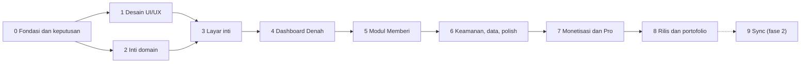

# Rizqflow — Roadmap

Breakdown proyek menjadi 10 tahap yang diselesaikan berurutan. **Status hidup ada di Notion**; dokumen ini adalah snapshot per 2026-09-23 untuk yang membaca kode langsung.

- Hub proyek: [Rizqflow di Ruang Finansial](https://app.notion.com/p/3e0edbb47c0b8184a091ddcf591766fd)
- Database tahap: [🧩 Tahap Rizqflow](https://app.notion.com/p/b5cf720718084e19a4cbb89a738c17ef)
- Database tugas dan log: [🚀 Pengembangan Rizqflow](https://app.notion.com/p/508597e5fd2c4424b9002c1956f02c5c)

Catatan progres dilakukan lewat skill `pengembangan-rizqflow` (lihat [CLAUDE.md](../CLAUDE.md)).

## Urutan dan ketergantungan

- Platform: **Android saja**, rilis di Google Play Store. Stack: **Kotlin + Jetpack Compose + Room** (2026-09-19).
- Arah visual: **opsi A**, pakai ulang identitas homepage roziqrizal.com (2026-09-19).
- Detail stack **disetujui 2026-09-20**: tiga modul Gradle (`:domain`, `:data`, `:app`), min SDK 26, DI manual, backup AES-GCM, tanpa SQLCipher untuk v1 (lihat [konsep.md](konsep.md)).
- Tahap 1 (desain) dan Tahap 2 (inti domain) bisa berjalan paralel setelah Tahap 0 selesai.
- Tahap 9 sengaja opsional: mulai hanya bila ada sinyal kebutuhan dari pengguna nyata.
- Tahap 10 (fitur wajib dari riset pasar) dan Tahap 11 (input cerdas on-device) ditambahkan 2026-09-23. Keduanya tidak bergantung pada Tahap 8; urutan terhadap rilis ditentukan pemilik (usulan: butir High Tahap 10 sebelum rilis, sisanya sesudah).

## Tahap 0 — Fondasi dan keputusan (In Progress)

Menetapkan keputusan yang menentukan arah teknis dan bisnis sebelum kode ditulis.

- [x] Diskusi konsep, posisi produk, dan nama Rizqflow
- [x] Buat repo dan dokumen konsep awal
- [x] Rumuskan model bisnis freemium ([monetisasi.md](monetisasi.md))
- [x] Susun breakdown tahap, spesifikasi layar, dan flow UI
- [x] Pasang tracking Notion, skill `pengembangan-rizqflow`, dan CLAUDE.md repo
- [x] Putuskan platform: Android saja, rilis di Play Store (2026-09-19)
- [x] Putuskan stack Android: Kotlin + Jetpack Compose + Room (2026-09-19)
- [x] Setujui detail stack Android: modul, min SDK 26, DI manual, enkripsi (2026-09-20)
- [x] Cek ketersediaan nama (2026-09-21): pencarian "rizqflow" di Google Play dan pangkalan merek DJKI tanpa hasil; rizqflow.com dipegang pihak lain, rizqflow.app dan .id bebas ([konsep.md](konsep.md))
- [x] Putuskan sumber harga emas: input manual (gratis), otomatis lewat API (Pro); riset API dilakukan di Tahap 7 (2026-09-20)
- [x] Putuskan kalender Hijriyah untuk haul: Umm al-Qura di balik antarmuka `HijriCalendar`; hisab Al-Kaukaba bisa menyusul (2026-09-21)
- [x] Tetapkan asumsi fikih default zakat mal: 85 g emas, 2,5%, haul 1 tahun Hijriyah (2026-09-20); default sementara, menunggu verifikasi kitab oleh pemilik
- [ ] Validasi minat lewat landing page dan daftar tunggu

## Tahap 1 — Desain UI/UX (Selesai)

Spesifikasi teks sudah ada di [ui-flow.md](ui-flow.md); tahap ini mengubahnya menjadi desain visual.

- [x] Putuskan arah visual: opsi A, pakai ulang identitas homepage (2026-09-19)
- [x] Tetapkan design tokens dan komponen dasar ([design/tokens.css](design/tokens.css))
- [x] Wireframe seluruh layar (S01–S31), termasuk keadaan kosong ([wireframe.md](wireframe.md), 2026-09-21)
- [x] Hi-fi layar kunci: Denah, Catat + Pratinjau alokasi, Detail ruang, Kartu haul (prototipe HTML di [design/](design/README.md); disetujui pemilik 2026-09-20)
- [x] Prototipe klik untuk flow F1–F9 dan seluruh layar S01–S28 (2026-09-21); pembayaran, izin, dan notifikasi tetap disimulasikan
- [x] Uji prototipe dengan pola data nyata dari Transaksi Harian di Ruang Finansial (2026-09-21): dua perbaikan tata letak di teks 200% dan temuan model data (lihat [design/README.md](design/README.md) dan [model-data.md](model-data.md))

## Tahap 2 — Inti domain, tanpa UI (Selesai)

Logika bisnis yang benar dan teruji sebelum ada layar.

- [x] Rancang model data dan skema penyimpanan lokal: [model-data.md](model-data.md), skema Room versi 1 di `:data` dengan berkas skema JSON (2026-09-21)
- [x] Value object Money (bilangan bulat, aritmetika eksak) (2026-09-20)
- [x] Aturan pembulatan alokasi: metode sisa terbesar, prioritas sebagai pemutus seri (2026-09-21)
- [x] Rule engine alokasi persentase: `AllocationEngine`, basis point, 20 tes (2026-09-21)
- [x] Definisikan arti "terpenuhi" per tipe ruang, ambang 85% untuk Mencukupi (2026-09-20, lihat [konsep.md](konsep.md))
- [x] Strategi modul Memberi: `zakat-haul-hijri` dan `percentage` (2026-09-21)
- [x] Kalkulator nisab dan haul Hijriyah, dengan dua kebijakan haul yang bisa diganti (2026-09-21)
- [x] Strategi unit test domain: [strategi-unit-test.md](strategi-unit-test.md), ditulis dari nol (2026-09-21)
- [x] Stub lapisan entitlement: `Entitlements`, `Feature`, `Plan`, `PlanEntitlements` (2026-09-21)
- [x] Setup proyek Android: modul domain terpisah, unit test, CI dasar (2026-09-20; CI pertama di GitHub hijau, 2026-09-20)
- [x] Lapisan buku kas: layanan onboarding, pencatatan, dan aturan alokasi di `:domain`; repositori Room dan satu database per akun di `:data`; 268 tes hijau (2026-09-21, lihat [model-data.md](model-data.md))

**Selesai bila:** unit test hijau untuk alokasi, nisab, dan haul (termasuk kasus tepi); tidak ada floating point untuk uang; skema penyimpanan punya jalur migrasi.

**Status 2026-09-21:** semua kriteria terpenuhi (82 tes domain hijau, skema Room versi 1 dengan berkas skema JSON dan larangan migrasi destruktif). Android Studio Quail 4 sudah terpasang dan build dengan JDK bawaannya lulus; image emulator API 37 sudah ada dan aplikasi berjalan di emulator (2026-09-21).

## Tahap 3 — Layar inti: onboarding, catat, transaksi (Selesai)

- [x] Tema Compose dari design tokens (warna terang dan gelap, font Manrope dan Libre Caslon Text, warna ruang dan status) dan kerangka navigasi (bottom nav empat tab, tombol Catat) (2026-09-21)
- [x] Splash dan halaman masuk dengan Google dan Gmail (S29, S30), riwayat masuk, dan ikon aplikasi (2026-09-21); proyek Google Cloud dan client ID sudah dibuat, masuk dengan Google teruji di emulator (2026-09-21); izin Gmail belum disiapkan ([auth-google.md](auth-google.md))
- [x] Masuk dengan nama pengguna dan sandi serta halaman Daftar (S30, S31): akun lokal dengan hash PBKDF2, tanpa server (2026-09-21)
- [x] Onboarding S02–S04 (S01 digantikan S30): pola ruang, pembagian persen (total selalu 100%), akun pertama dengan papan angka; Mulai kosong melewati langkah persentase; tiap akun membuka database sendiri (2026-09-21)
- [x] Catat transaksi (S06): tab Pemasukan, Pengeluaran, Transfer; ruang, kategori, akun, tanggal, catatan; banner lembut bila jatah bulan itu terlampaui; snackbar Urungkan (2026-09-21). Chip "Terakhir" dan "Jadikan favorit" menunggu S24
- [x] Pratinjau alokasi (S07): rezeki terlihat mengalir sebelum disimpan, "Ubah sekali ini" (aturan tidak berubah), bagian belum dialirkan (2026-09-21)
- [x] Daftar transaksi dan detail/edit (S08–S09): per bulan dan tanggal, cari catatan dan nominal, filter jenis, sheet saringan akun/ruang/kategori; detail memakai layar Catat (ubah semua kolom; nominal pemasukan dihitung ulang dengan potret alokasi), hapus dengan konfirmasi, Urungkan setelah ubah dan hapus (2026-09-21). Banner hari kosong dan baris draf menunggu Tahap 6 dan v1.1
- [x] Daftar ruang dan aturan alokasi (S10, S12): urutan naik/turun (= prioritas sisa pembulatan), arsipkan dan pulihkan (persen kembali 0%), tambah ruang (batas 5 ruang gratis; kategori awal Lain-lain dan Tak terlacak), pola Tiga hak untuk akun kosong, banner bila total bukan 100%; Aturan alokasi dengan slider dan +/- 1% untuk semua ruang, simpan hanya bila pas 100%, Buang perubahan?, Urungkan (2026-09-21). Aturan lanjutan (Pro) baru berupa pesan; status per ruang menunggu Tahap 4
- [x] Kelola akun, kategori, dan favorit (S13): tab Akun (tambah dengan saldo awal, ubah nama dan jenis, arsipkan, pulihkan, batas 3 akun gratis), tab Kategori per ruang (tambah, ganti nama, arsipkan; kategori sistem terkunci; ruang selalu punya satu kategori biasa), tab Favorit (ubah nama dan nominal, hapus, paling banyak 6); "Jadikan favorit" di Catat untuk pengeluaran baru (2026-09-21). Akun dan kategori hanya diarsipkan, tidak dihapus. Urutan favorit otomatis menurut pemakaian karena skema belum punya kolom urutan (seret untuk mengurutkan ditunda). Cocokkan saldo menunggu S25 (Tahap 6)
- [x] Catat kilat (S24): bottom sheet pengeluaran cepat dari pintasan ikon (tekan lama) dan tile Quick Settings; ketuk favorit langsung menyimpan dengan Urungkan, atau ketik nominal (ruang dan kategori terakhir, akun bisa dipilih); teruji di emulator (2026-09-21). Widget masuk Pro (Tahap 7); tindakan di notifikasi malam menunggu S26 (Tahap 6); chip favorit di layar Catat penuh ditunda
- [x] Mode demo dengan data contoh (S22): dari Coba data contoh di Denah kosong atau menu Lainnya; database demo terpisah yang diisi tiga ruang, tiga akun, dua bulan transaksi, dan empat favorit, lalu dihapus saat keluar; penanda Mode demo di header Denah (2026-09-21). Tema dan bahasa (bagian lain S22) menyusul di Tahap 6

**Selesai bila:** flow F1–F4 berjalan end-to-end tanpa jaringan; data bertahan; setiap layar punya empty state.

**Status 2026-09-21:** semua kriteria terpenuhi: onboarding, catat pemasukan dan pengeluaran dan transfer, ubah aturan alokasi, kelola akun dan kategori dan favorit, dan mode demo berjalan di emulator tanpa jaringan; data tersimpan di Room; tiap layar punya keadaan kosong. Yang ditunda ke tahap lain tercatat di butir masing-masing di atas.

## Tahap 4 — Dashboard Denah (Selesai)

- [x] Denah: ringkasan, grid ruang, perlu perhatian (S05): rezeki bulan ini dengan bar pembagian, kartu ruang (cincin, sisa, status ikon plus teks), Perlu perhatian maksimal 3 butir, navigator bulan, keadaan kosong; teruji di emulator (2026-09-21). Belum ada: tanggal Hijriyah dan butir haul (Tahap 5), butir saldo belum dicocokkan (Tahap 6), mode demo dari keadaan kosong (S22), kartu bisa dibuka ke S11
- [x] Detail ruang (S11): cincin progres, terpakai dari jatah, status ikon plus teks dengan penjelasan arti per tipe, pos dengan batang (pembanding: irisan jatah menurut bobot, kosong = seluruh jatah ruang), lima pengeluaran terbaru yang bisa dibuka ke Detail transaksi, Atur aturan, dan Arsipkan ruang dengan konfirmasi dan Urungkan yang mengembalikan urutan dan persentase; dibuka dari kartu di Denah dan baris di Ruang (2026-09-21). Kartu Zakat untuk ruang Memberi menunggu Tahap 5
- [x] Logika status ruang per tipe dan tesnya: `RoomStatusRules` (ambang 85% Mencukupi, batas inklusif) dan `DenahLoader` (rezeki bulan itu, belum dialirkan, kartu per ruang, butir Perlu perhatian maksimal 3), 18 tes (2026-09-21). Menunggu konfirmasi: penilaian Mencukupi di akhir bulan dan label bulan lalu yang belum tercapai
- [x] State tepi: bulan kosong, banyak ruang, font besar, mode gelap (2026-09-22). Dicek di emulator untuk Denah dan daftar Ruang dengan 7 ruang (paket Pro sementara untuk melewati batas 5, lalu dikembalikan ke gratis): grid dua kolom tetap rapi dengan baris ganjil, satu kolom di font 200%, terbaca di mode gelap, ringkasan Pembagian rezeki membungkus benar. Temuan sekalian: menurunkan paket dari Pro ke gratis saat ruang aktif melebihi batas tidak menghapus ruang yang sudah ada, hanya memblokir tambahan baru dengan pesan "Batas ruang paket gratis tercapai" — perilaku yang benar

**Selesai bila:** status benar untuk ketiga tipe ruang; semua state punya tampilan; terbaca di font 200% dan mode gelap.

**Status 2026-09-22:** semua kriteria terpenuhi dan teruji di emulator termasuk kasus tepi >5/>6 ruang. Kartu Zakat (Memberi) dan butir haul/saldo di Denah menunggu Tahap 5 dan 6 seperti tercatat di atas.

## Tahap 5 — Modul Memberi: zakat dan haul (Selesai)

Pembeda utama produk.

- [x] Beranda Zakat dan profil harta (S14–S15) (2026-09-22): ZakatService (overview, saveWealth, payZakat) di `:domain` dan `:data`; layar Zakat dengan kartu status, nisab, harga emas, riwayat; Profil harta dengan harga emas per gram, baris bawaan (emas dalam gram, uang dan tabungan, investasi, piutang lancar), harta bebas tambah, dan hutang jangka pendek. Jalan masuk: kartu Zakat di Detail ruang untuk ruang bertipe Menunaikan. Teruji di emulator: isi harta lengkap, nisab dan harta bersih cocok skenario tes, data tersimpan dan termuat ulang benar
- [x] Kartu haul dan rincian perhitungan (S16) (2026-09-22): digabung ke kartu status S14 (Belum mencapai nisab, Haul berjalan dengan hari ke-n dari total dan jatuh tempo Hijriyah, Haul genap) memakai `HaulTracker`, bukan layar rincian terpisah — penyederhanaan cakupan
- [x] Tunaikan zakat menjadi transaksi (S17) (2026-09-22): bottom sheet dengan nominal bawaan 2,5% dari harta bersih (bisa diubah), akun sumber, kategori Zakat mal otomatis di ruang itu; menyimpan mencatat pengeluaran biasa dan memulai haul baru. Diuji lewat ZakatTest (Room sungguhan): haul genap sampai tunaikan tersimpan dan haul baru mulai. Belum diuji manual di emulator karena perlu memutar kalender sistem untuk mencapai haul genap
- [x] Pengingat haul (notifikasi): dikerjakan di Tahap 6 (2026-09-22) karena memakai infrastruktur notifikasi S26 yang sama, bukan diduplikasi di sini
- [x] Putuskan pengingat haul untuk satu profil: tetap gratis, multi-profil Pro (disetujui pemilik 2026-09-24, [monetisasi.md](monetisasi.md))
- [x] Mode alternatif persentase donasi (2026-09-22): sakelar "Persentase donasi biasa" di S14, memakai `PercentageGivingStrategy` yang sudah ada sejak Tahap 2; ruang Memberi bawaan pola Tiga hak mulai di mode ini, bisa dipindah ke zakat mal kapan saja tanpa kehilangan data harta
- [x] Tes kasus tepi haul dan nisab (2026-09-22): `HaulTrackerTest` dan `ZakatCalculatorTest` (Tahap 2) plus `ZakatServiceTest` baru (mulai haul, genap, reset di bawah nisab, tunaikan sebelum dan sesudah genap) dan `ZakatTest` di lapisan data
- [x] Disclaimer dan tampilan sumber fikih (S23) (2026-09-22): versi ringkas di footer S14 dan layar Tentang lengkap (versi aplikasi, privasi, asumsi fikih dengan penanda belum diverifikasi, disclaimer, Kebijakan privasi dan Lisensi pihak ketiga sebagai sheet dalam aplikasi, Kirim masukan lewat email); jalan masuk baris Tentang di menu Lainnya, teruji di emulator

**Selesai bila:** flow F5 berjalan end-to-end termasuk reset haul; asumsi fikih dan disclaimer tampil; modul bisa dimatikan tanpa merusak aplikasi.

**Status 2026-09-22:** semua kriteria terpenuhi (flow F5 teruji lewat ZakatTest dan emulator, disclaimer ringkas dan layar Tentang lengkap tampil, modul bisa dimatikan lewat sakelar persentase donasi tanpa kehilangan data). Pengingat haul (notifikasi) semula tersisa, lalu dikerjakan di Tahap 6 karena butuh infrastruktur notifikasi yang sama dengan S26 (selesai 2026-09-22). Keputusan tier pengingat haul (satu profil gratis, multi-profil Pro) disetujui pemilik 2026-09-24, sehingga seluruh kriteria terpenuhi dan tahap ditutup.

## Tahap 6 — Keamanan, data, dan polish (In Progress)

- [x] Kunci PIN dan biometrik (S19): PIN 6 angka diketik dua kali, lima kali salah menahan sementara 30 detik tanpa menghapus data, biometrik hanya bisa aktif setelah ada PIN dan bila tersedia di perangkat, kunci otomatis (segera/1/5/15 menit) diperiksa lewat lifecycle Activity saat kembali dari latar belakang, start dingin selalu terkunci bila ada PIN, FLAG_SECURE menyembunyikan nominal di tampilan aplikasi terakhir dan tangkapan layar; menu Lainnya > Keamanan untuk ubah PIN dan matikan kunci (keduanya minta PIN sekarang dulu); teruji ujung ke ujung di emulator termasuk lockout, kedua mode kunci otomatis, dan tampilan aplikasi terakhir (2026-09-22)
- [x] Backup dan restore terenkripsi (S20) (2026-09-22): menu Lainnya > Backup dan data. Cadangkan menyalin berkas SQLite Room apa adanya (checkpoint WAL dulu supaya lengkap) dan mengenkripsinya AES-256-GCM dengan kunci PBKDF2-HMAC-SHA256 dari sandi pengguna (`BackupCrypto` di `:domain`, garam dan IV acak per cadangan, sandi minimal 6 karakter, dua kali ketik); berkas dibagikan lewat Storage Access Framework. Pulihkan meminta berkas lalu sandi dengan konfirmasi eksplisit menimpa data; sandi salah atau berkas rusak menampilkan pesan tanpa menyentuh data sekarang. Restore menutup ruang kerja, menimpa berkas database (menghapus sisa `-wal`/`-shm` lama), lalu membuka ulang — menu dan tab kembali ke Denah dengan data baru. Diuji: `BackupCryptoTest` (bolak-balik, sandi salah, berkas rusak, berkas terlalu pendek) di `:domain`; `:app:assembleDebug` dan unit test `:app`/`:data` lulus
- [x] Ekspor dan impor CSV: menu Lainnya > Ekspor dan impor CSV. Ekspor menulis seluruh transaksi apa adanya (nama akun/ruang/kategori, bukan pengenal) lewat Storage Access Framework. Impor mengurai ekspor CSV Notion "Transaksi Harian" lewat nama kolom (bukan posisi), mencocokkan nama akun/kategori persis (tanpa membedakan huruf besar/kecil) ke data aplikasi, menyatukan pasangan pemasukan/pengeluaran yang tanggal-nominal-akunnya cocok jadi satu Transfer, dan menampilkan pratinjau (siap/dilewati dengan alasan) sebelum tombol Impor menyimpan apa pun; baris yang akunnya atau kategorinya tidak dikenali dilewati dengan alasan, tidak ditebak. Teruji ujung ke ujung di emulator: ekspor ditarik dan diperiksa isinya, impor CSV Transaksi Harian mengimpor pengeluaran/pemasukan/satu pasangan transfer dengan benar dan melewati baris tak dikenal (2026-09-22)
- [x] Mode gelap, skala font, aksesibilitas: audit formal atas seluruh layar. Ditemukan dan diperbaiki: 6 tombol stepper persen (Review pemasukan, onboarding, Aturan alokasi) 44dp naik ke 48dp (target sentuh minimal); pemilih ikon ruang baru membacakan kunci mentah ("heart") ke TalkBack, diganti label Indonesia; ikon peringatan (statusWarning) di mode terang hanya berkontras ~1,6:1 terhadap pita peringatannya sendiri (di bawah 3:1 WCAG), digelapkan khusus mode terang setelah dikonfirmasi pemilik produk, mode gelap dibiarkan (sudah ~10:1); 6 teks satu baris (judul/subjudul transaksi, label bulan, label tab Catat) ditambah TextOverflow.Ellipsis supaya terpotong rapi di font besar, bukan mentah. Tidak ditemukan: kekurangan contentDescription pada elemen ikon-saja (semua sudah lewat IconButton dengan label), warna literal yang lolos dari tema (kecuali satu pengecualian sengaja mengikuti pedoman merek Google di tombol masuk). Kontras token warna (teks vs latar, tombol utama, identitas ruang, dan kini statusWarning) dijaga otomatis lewat RizqflowTokensTest (10 tes) supaya tidak rusak diam-diam. Belum diverifikasi visual layar demi layar di skala font 200%/mode gelap pasca-S19: FLAG_SECURE (S19) memblokir tangkapan layar dan perekaman layar aplikasi ini di semua metode termasuk adb, jadi verifikasi mengandalkan tinjauan kode dan tes kontras otomatis, bukan piksel; Denah dan daftar Ruang sudah diverifikasi visual sebelum S19 (lihat Tahap 4) (2026-09-22)
- [x] Layar Tampilan: saklar tema Otomatis/Terang/Gelap di menu Lainnya (diminta pemilik produk setelah audit aksesibilitas; sebelumnya cuma mengikuti sistem tanpa saklar, seperti dicatat di komentar `Theme.kt` sejak awal). `ThemePreference` menyimpan pilihan di SharedPreferences terpisah dari akun, dibaca reaktif lewat StateFlow; gaya ikon status/navigasi bar dihitung ulang tiap tema berubah, bukan cuma sekali di `onCreate`, supaya tetap kontras saat tema dipaksa berbeda dari sistem. Teruji di emulator: ketiga pilihan tersimpan benar dan bertahan lewat start dingin (2026-09-22)
- [x] Lokalisasi Indonesia dan Inggris (2026-09-22): seluruh string UI (~290 resource, termasuk plural dan dua `string-array` baru untuk singkatan bulan dan nama bulan Hijriyah) diterjemahkan ke `values-en/strings.xml`, default `values/strings.xml` tetap Indonesia. Label tanggal "Hari ini"/"Kemarin" dan singkatan bulan Masehi di `Format.kt`, yang sebelumnya di-hardcode di luar sistem resource, sekarang lewat string resource (`formatDate`/`formatMonth` jadi Composable; inti murni `formatDateWith`/`formatMonthWith` dipertahankan supaya tetap bisa diuji lewat kotlin.test tanpa Robolectric). Nama bulan Hijriyah di `HijriDate.format()` (`:domain`) menerima parameter opsional supaya `:app` bisa melewatkan versi Inggris tanpa `:domain` bergantung ke resource Android. Notasi Rupiah dan persen (titik ribuan, koma desimal) sengaja tidak diubah karena mata uangnya tetap Rupiah di kedua bahasa. Diverifikasi: `:app:assembleDebug` dan seluruh unit test `:domain`/`:data`/`:app` lulus, serta dicek langsung di emulator lewat `cmd locale set-app-locales ... en-US`: tab, tanggal, dan label status berganti ke Inggris; nama ruang/kategori buatan pengguna tetap seperti aslinya (data, bukan string aplikasi)
- [x] Pengingat malam dengan balasan langsung dan tindakan "Tidak ada" (S26): jam dan aktif/tidak bisa diatur, WorkManager menjadwalkan satu notifikasi per hari, balasan semacam "kopi 25000" tersimpan sebagai pengeluaran (ruang dan kategori pengeluaran terakhir), izin notifikasi Android 13+ diminta sekali setelah transaksi pertama tersimpan; teruji di emulator ujung ke ujung termasuk kedua aksi notifikasi (2026-09-22)
- [x] Pengingat haul (2026-09-22): `HaulReminderService` (`:domain`) menumpang pengecekan di `ReminderWorker` yang sudah ada (S26) alih-alih worker/scheduler terpisah — sesuai keputusan di atas. Menyapa sekali per ambang batas per ruang Memberi bermode zakat (penanda `haul_reminder_notified_<ruang>` di `SettingsRepository`, bukan tiap hari), dengan dua pemicu: mendekati genap (≤7 hari lagi) dan genap. `ReminderNotifier.showHaul` memakai channel dan id notifikasi terpisah dari pengingat malam (channel `reminder_haul`, importance default), tanpa aksi Balas/Tidak ada. Sengaja hanya jalan bila pengingat malam aktif, supaya tidak menduplikasi jadwal WorkManager. Diuji lewat `HaulReminderServiceTest` (mendekati, genap, ditandai supaya tidak berulang, tunaikan memulai haul baru dan menghentikan pengingat lama); `:domain:test`, `:app:assembleDebug`, dan unit test `:app`/`:data` lulus. Belum diuji manual di emulator (perlu memutar kalender sistem untuk mencapai ambang haul, sama seperti S17)
- [x] Koreksi saldo (S25): menu Lainnya, pilih akun, saldo sebenarnya dibandingkan catatan; selisih lebih kecil dicatat pengeluaran Tak terlacak di ruang usulan (dari pengeluaran terakhir akun itu), lebih besar dicatat pemasukan biasa yang dialirkan seperti pemasukan lain, sama hanya memperbarui tanggal cocok; teruji di emulator untuk akun tunai dan bank (2026-09-22)
- [x] Petunjuk hari kosong di daftar transaksi (2026-09-22): S08, banner lembut "Kemarin belum ada catatan pengeluaran" dengan Catat sekarang (buka Catat kilat S24) dan Tidak ada, hanya saat daftar tidak difilter akun. Berbagi penanda `day_check` yang sama dengan pengingat malam S26 (`ReminderService.shouldShowEmptyDayHint`/`dismissEmptyDayHint`), hanya beda hari yang ditandai (kemarin, bukan hari ini) dan tidak tampil sebelum transaksi pertama. Diuji: 5 tes baru `ReminderServiceTest`; `:app:assembleDebug` dan unit test `:app`/`:data` lulus
- [x] "Perlu perhatian: saldo belum dicocokkan" di Denah untuk akun yang lama tidak dikoreksi (2026-09-23): `AttentionItem.AccountNotReconciled` di `DenahLoader`, prioritas terakhir setelah ruang lewat/mendekati jatah dan rezeki belum dialirkan (sesuai urutan di [ui-flow.md](ui-flow.md)). Akun aktif yang `lastReconciledOn`-nya lebih dari 7 hari lalu ditandai; akun yang belum pernah dicocokkan sama sekali sengaja tidak ditandai (baru "berumur" sejak koreksi pertamanya, bukan sejak dibuat — tidak ada kolom tanggal dibuat di skema akun). Baris di Denah membuka Koreksi saldo (S25) langsung ke akun itu, memakai state `reconcileAccount`/`ReconciliationScreen(initialAccountId=...)` yang sama dengan jalan masuk menu Lainnya. Diuji: 5 tes baru `DenahTest` (belum pernah dicocokkan, batas tepat 7 vs 8 hari, urutan setelah rezeki belum dialirkan, banyak akun diurutkan dari paling lama, akun terarsip tidak ikut ditandai); `:domain:test`, `:app:assembleDebug`, dan unit test `:app`/`:data` lulus

**Selesai bila:** PIN/biometrik tidak bisa dilewati; backup lalu restore di perangkat lain menghasilkan data identik; koreksi saldo mencatat selisih dengan benar untuk akun tunai, e-wallet, dan bank.

**Status 2026-09-23:** seluruh tugas terdaftar di atas sudah selesai (termasuk butir Denah terakhir). Dua kriteria masih menunggu verifikasi manual yang belum tercatat dilakukan (lihat checklist "Kriteria selesai" di halaman Tahap 6 Notion): **restore di perangkat fisik lain** (baru diuji bolak-balik di emulator/`BackupCryptoTest`, belum lintas perangkat) dan **berkas ekspor CSV dibuka di aplikasi spreadsheet sungguhan** (baru diperiksa isinya di emulator, belum di Sheets/Excel). PIN/biometrik dan koreksi saldo sudah terverifikasi sesuai kriteria.

## Tahap 7 — Monetisasi dan Pro (In Progress)

- [x] Paywall bottom sheet dan titik penguncian (S21) (2026-09-23): `PaywallSheet` (`ui/paywall/`), tiga manfaat dari `Feature` yang memicu (butir yang memicu didahulukan, lalu diisi dari tiga manfaat mockup ui-flow.md), harga placeholder Rp 129.000 (belum final, lihat monetisasi.md). Titik penguncian ruang (S10, ruang ke-6) dan akun (S13) membuka S21 langsung, bukan sekadar pesan seperti sebelumnya. Baris "Rizqflow Pro" baru di menu Lainnya (S18), subjudul mengikuti status pembelian. `PurchaseStore` (`:app`, SharedPreferences app-wide seperti `ThemePreference`) dan `LivePlanEntitlements` (`:domain`, membaca ulang paket tiap dipanggil) menggantikan `PlanEntitlements()` yang dulu selalu kosong (`AccountWorkspace`) — tetapi **belum terhubung ke Google Play Billing sungguhan**: tombol Beli dan Pulihkan pembelian sengaja hanya menampilkan pesan "belum tersedia" (`pro_purchase_unavailable`), tidak membuka Pro, supaya tidak ada jalan buka-Pro-gratis yang tidak sengaja. `PurchaseStore.grant()` sudah ada sebagai seponsel Billing Client menyusul, tapi belum dipanggil dari mana pun. Diuji: 1 tes baru `EntitlementsTest` (LivePlanEntitlements membaca ulang, bukan potret sekali dibuat); `:domain:test`, `:app:assembleDebug`, dan unit test `:app`/`:data` lulus
- [ ] Integrasi pembelian (Google Play Billing) dan pulihkan pembelian — butuh produk in-app terdaftar di Play Console (Tahap 8) dulu; `PurchaseStore.grant()` adalah seponsel yang akan dipanggil dari sini
- [x] Pro: ruang peran tak terbatas dan sistem per peran (2026-09-23): batas jumlah ruang sudah dibuka otomatis begitu `Plan.PRO` dimiliki (`Entitlements.roomLimit`, sejak Tahap 2); sistem per peran adalah modul opsional per ruang (`RoleService`, `Feature.ROLE_SYSTEMS`, layar S32 dari kartu Peran di Detail ruang). **Trader:** modal dan risiko per trade menghasilkan batas rupiah; pengeluaran di ruang itu yang melewatinya memunculkan banner lembut di Catat. **Investor:** jadwal DCA bulanan (nominal, tanggal 1 sampai 28, akun, kategori) yang dicatat sebagai pengeluaran di ruang itu (bukan transfer, sesuai keputusan investasi = pengeluaran); status Selesai/Jatuh tempo/Akan datang dihitung dari transaksi, dan pengingat sekali per bulan menumpang `ReminderWorker` (`DcaReminderService`, hanya jalan bila pengingat malam aktif, seperti pengingat haul). Persistensi: tabel `trader_profile` dan `dca_plan` (migrasi `MIGRATION_2_3`, skema versi 3). Turun paket tidak menghapus data, hanya membuat peringatan dan pengingat diam; melepas peran selalu boleh. Diuji: 22 tes `RoleServiceTest` (domain), 5 tes `RoleTest` dan 1 tes migrasi baru (`:data`); `:app:assembleDebug` lulus; teruji di emulator (Pro dipasang lewat SharedPreferences): Trader menghasilkan batas Rp 100.000 dari modal Rp 10 juta di 1%, banner muncul di Rp 1.000.000 dan tidak di tepat Rp 100.000, DCA jatuh tempo lalu Catat sekarang menjadikannya Selesai, lepas peran tersimpan. Belum diuji manual: notifikasi pengingat DCA (perlu memutar tanggal sistem) dan banner risiko di Catat kilat (S24, jalur favorit menyimpan langsung tanpa banner). Belum ada: kolom urutan atau jurnal trade, batas risiko harian, banyak jadwal DCA per ruang
- [x] Pro: aturan alokasi lanjutan (2026-09-23): mode waterfall (`AllocationMode`, `AllocationEngine.allocateWaterfall`) — satu toggle untuk seluruh ruleset (bukan campur per ruang), ruang diisi berurutan menurut prioritas (`sort_order`, sama seperti pemutus seri persentase) sampai batas atas rupiahnya (`AllocationCap`, kosong = tak terbatas), kelebihan mengalir otomatis ke ruang berikutnya. Potretnya tetap persentase seperti biasa (`AllocationEngine.impliedShares`) supaya perubahan nominal transaksi (S09) tetap memakai mekanisme lama tanpa kolom snapshot baru. Persistensi: kolom baru `allocation_rule.cap_amount` (migrasi Room `MIGRATION_1_2`, skema naik ke versi 2) dan mode tersimpan di `app_setting` (tanpa tabel baru). S12 punya dua chip mode; memilih "Lanjutan" tanpa Pro membuka paywall (`Feature.ADVANCED_ALLOCATION_RULES`). Mengubah salah satu mode membawa serta nilai mode lain (ganti persentase tidak menghapus batas atas tersimpan, dan sebaliknya). Diuji: 8 tes baru `AllocationEngineTest`, 6 tes baru `RuleServiceTest`, 4 tes baru `LedgerServiceTest` (termasuk memastikan pengeditan nominal memakai potret persentase, bukan menjalankan ulang waterfall), 1 tes migrasi baru (`MigrationTest`, lihat catatan `MigrationTestHelper` di model-data.md); `:domain:test`, `:data:test`, `:app:assembleDebug`, dan unit test `:app` lulus. Belum ada: UI drag-reorder prioritas di S12 (pakai urutan yang sudah ada di S10); Urungkan belum ditawarkan untuk simpan aturan lanjutan (hanya mode persentase)
- [x] Pro: multi-profil haul (2026-09-23): profil harta tambahan (mis. istri, usaha) di modul Memberi, tiap profil dengan harta, haul, riwayat zakat, dan pengingatnya sendiri. Profil pertama (Utama) gratis dan dibuat otomatis; profil tambahan butuh `Feature.MULTI_ZAKAT_PROFILE` (Pro). `ZakatRepository.activeProfile()` diganti `profiles()` (urut menurut pembuatan) dan `findProfile()`; `ZakatService` menerima `profileId` di `overview`, `saveWealth`, dan `payZakat`, plus `addProfile`, `renameProfile`, `archiveProfile` (profil aktif terakhir tidak bisa diarsipkan). Tanpa perubahan skema: kolom `zakat_profile.archived` dan `name` sudah ada sejak versi 1, urutan memakai rowid. Profil yang baru ditambah belum punya pemeriksaan harta, jadi statusnya meminta harta diisi (bukan belum mencapai nisab). Turun paket tidak mengunci profil yang sudah ada (hanya menambah yang baru), dan ganti nama serta arsip selalu boleh. Pengingat haul kini per ruang dan per profil (`haul_reminder_notified_<ruang>_<profil>`; penanda lama per ruang tidak dipakai lagi, jadi ambang yang sedang aktif bisa disapa sekali lagi setelah pembaruan), menyebut nama profil bila ada lebih dari satu, dan tanpa Pro hanya profil pertama yang disapa (default kerja menunggu konfirmasi, lihat monetisasi.md). Zakat yang ditunaikan mencatat nama profil di catatan transaksi bila ada lebih dari satu profil. Layar: pemilih profil (chip, + Profil, Ubah nama, Arsipkan) di S14; profil tambahan tanpa Pro membuka S21. Diuji: 14 tes baru `ZakatProfilesTest`, 1 tes `ZakatTest` (Room); teruji di emulator (Pro lewat SharedPreferences): tambah profil Istri, pindah profil, arsipkan dengan konfirmasi, dan tanpa Pro profil yang ada tetap terlihat. Belum diuji manual: notifikasi haul per profil dan alur Tunaikan zakat untuk profil kedua (perlu memutar kalender sistem, sama seperti S17). Belum ada: kebijakan haul berbeda per profil di layar (kolom `haul_break_policy` sudah per profil), memindahkan harta antar profil
- [ ] Info lembut di kartu profil haul tambahan: "Pengingat aktif hanya untuk profil pertama" bila tanpa Pro, supaya pengingat yang diam tidak mengejutkan
- [ ] Pro: harga emas otomatis (butuh riset API)
- [ ] Pro: laporan dan insight, multi-mata uang, widget, tema
- [ ] Uji alur pembelian dengan penguji lisensi

**Selesai bila:** semua penguncian lewat satu lapisan entitlement; akses tidak hilang setelah pasang ulang atau ganti perangkat.

**Status 2026-09-23:** paywall, titik penguncian, aturan alokasi lanjutan, sistem per peran, dan multi-profil haul selesai; sisanya (billing sungguhan, harga emas otomatis, laporan/insight/multi-mata uang/widget/tema, uji penguji lisensi) menunggu, sebagian bergantung pada akun developer Play Console (Tahap 8).

## Tahap 8 — Rilis dan portofolio (Backlog)

- [ ] Akun developer, profil pembayaran, dan pajak
- [ ] Kebijakan privasi, deklarasi fitur finansial, dan data safety
- [ ] Uji tertutup Play Console (cek syaratnya sejak awal; memengaruhi jadwal)
- [ ] Store listing
- [ ] Case study di roziqrizal.com, README Inggris, video demo

## Tahap 9 — Fase 2: Sync dan ruang keluarga (Backlog, opsional)

- [ ] Riset arsitektur sync terenkripsi end-to-end dan biaya
- [ ] Ruang keluarga bersama
- [ ] Langganan Sync dan backend minimal
- [ ] Peran anggota keluarga (pengelola, pemberi jatah, anggota pencatat, anak) dan amplop uang bulanan
- [ ] Notifikasi saat anggota keluarga mencatat (push dari backend sync)
- [ ] Bot WhatsApp resmi tersinkron ke aplikasi (WhatsApp Business API; riset biaya dan verifikasi bisnis dulu)
- [ ] Input AI berbasis LLM dengan kuota per paket, hanya bila parser on-device Tahap 11 belum cukup

Jangan dimulai sebelum Pro terbit dan ada sinyal bahwa pengguna memang butuh berbagi data antar-perangkat atau antar-anggota keluarga.

## Tahap 10 — Celah riset: fitur wajib (Backlog)

Menutup kesenjangan fitur wajib dari [riset pasar](research-market/research.md) (kecocokan sekitar 47% sebelum tahap ini, target sekitar 65–70%). Semua tanpa server. Ditambahkan 2026-09-23; disarankan selesai sebelum Tahap 8, atau minimal butir prioritas High.

- [x] Sisa aman hari ini di Denah dan Catat (High) (2026-09-24): `SafeToSpend` di `:domain` dengan 15 tes (termasuk lewat `DenahLoader` dengan pemasukan dan pengeluaran nyata); kartu di Denah bulan berjalan, dan baris "Sisa aman hari ini" / "setelah ini" di Catat untuk pengeluaran baru bertanggal hari ini serta di Catat kilat (S24). Rumus di [konsep.md](konsep.md). Teruji di emulator (2026-09-24): Denah, Catat, dan Catat kilat menampilkan angka yang sama dan berubah benar setelah pengeluaran
- [x] Transaksi berulang: harian, mingguan, bulanan (High) (2026-09-24): `RecurringService` di `:domain` (jadwal dihitung dari tanggal awal supaya tidak bergeser di bulan pendek, pengenal transaksi tetap per kemunculan sehingga mengejar yang terlewat tidak menggandakan, jeda, tanggal akhir, kemunculan yang tertahan dilaporkan) dengan 30 tes; tabel `recurring_rule` dan migrasi 3 ke 4 di `:data` (skema versi 4) dengan 4 tes Room dan 1 tes migrasi; layar S33 dari menu Lainnya. Pencatatan berjalan saat aplikasi dibuka dan tiap kembali ke depan, tanpa penjadwal latar belakang, jadi tidak ada notifikasi saat kemunculan tercatat. Teruji di emulator (2026-09-24): tambah aturan bulanan, kemunculan pertama langsung tercatat, buka ulang aplikasi tanpa duplikat, jeda dan lanjutkan, hapus aturan dengan transaksi tetap ada, dan migrasi pada data lama. Belum ada: mengejar kemunculan yang terlewat belum diuji di emulator (perlu memutar tanggal sistem; sudah diuji lewat tes domain dan Room), notifikasi saat tercatat, tanggal mulai di masa lalu, dan Urungkan untuk hasil pencatatan otomatis
- [x] Pengingat tagihan dan cicilan (High) (2026-09-24): entitas `Bill` terpisah dari transaksi berulang karena pembayarannya terjadi di luar aplikasi, jadi tidak pernah dicatat otomatis; pengguna mengetuk Bayar, barulah pengeluaran tercatat dan jatuh tempo maju. Sekali bayar, bulanan, atau mingguan, dengan jumlah cicilan opsional (kosong = tanpa batas) dan "sudah dibayar sebelumnya" untuk cicilan yang sudah berjalan; jatuh tempo boleh sudah lewat (terlambat). Membayar lewat `LedgerService` (`origin = BILL`, pengenal tetap `bill-<id>-<jatuh tempo>` supaya tidak ganda), nominalnya boleh diubah (listrik dan air), dan bisa diurungkan. `BillReminderService` menumpang `ReminderWorker` seperti haul dan DCA, jadi hanya jalan bila pengingat malam aktif: tiga hari sebelum, hari-H, dan sekali saat terlambat, lalu diam sampai dibayar; layar memberi petunjuk bila pengingat malam mati. Tabel `bill` dan migrasi 4 ke 5 (skema versi 5), layar S34 dari menu Lainnya. Diuji: 35 tes domain, 6 tes Room, dan 1 tes migrasi baru; seluruh 782 tes hijau. Teruji di emulator (2026-09-24): cicilan 3 kali, Bayar tercatat "Cicilan motor (1/3)" dengan jatuh tempo maju dan Urungkan mengembalikannya, tanggal lampau bisa dipilih, dan notifikasi "Internet is due in 2 days" muncul saat worker dipaksa jalan. Belum ada: tagihan di "Perlu perhatian" Denah, Lewati bulan ini, tanggal bayar selain hari ini, bayar dari notifikasi, tagihan di mode demo, dan pengujian notifikasi tahap hari-H dan terlambat di emulator (perlu memutar tanggal sistem; sudah diuji lewat tes domain dan Room)
- [x] Utang-piutang, terhubung ke profil harta zakat (High) (2026-09-24): entitas `Debt` (piutang `LENT` atau utang `BORROWED`, nama pihak, pokok, jatuh tempo opsional, catatan, lancar atau macet) dengan pelunasan sebagian atau penuh (`DebtPayment`); sisa dihitung dari pelunasan, tidak disimpan. Perpindahan uangnya memakai dua jenis transaksi baru, `LOAN_OUT` dan `LOAN_IN`, yang **hanya menggeser saldo akun**: meminjamkan bukan pengeluaran (tidak memakan jatah ruang) dan meminjam bukan pemasukan (tidak dialirkan ke ruang, tidak masuk Sisa aman hari ini); rumus saldo Room, ekspor CSV, dan daftar Transaksi ikut menanganinya, dan transaksi pinjaman tidak bisa diubah dari Detail (ketukannya membuka layar Utang-piutang). Pinjaman lama yang uangnya bergerak sebelum dicatat bisa dicatat tanpa menyentuh saldo. Hapus utang menghapus pelunasan dan transaksi saldonya (saldo kembali); hapus satu pelunasan dan Urungkan tersedia. Pengingat jatuh tempo (tiga hari sebelum, hari-H, sekali saat terlambat) memakai aturan bersama `DueReminders` dengan tagihan dan menumpang `ReminderWorker`. **Tautan zakat:** `DebtService.zakatSuggestion` menghasilkan sisa piutang lancar dan sisa utang jangka pendek (jatuh tempo dalam 12 bulan atau tanpa jatuh tempo); di S15 muncul sebagai saran dengan tombol Pakai, tidak pernah masuk otomatis (asumsi lancar/macet dan batas 12 bulan belum diverifikasi dengan kitab). Tabel `debt` dan `debt_payment`, migrasi 5 ke 6 (skema versi 6), layar S35 dari menu Lainnya. Diuji: 29 tes domain, 8 tes Room, dan 1 tes migrasi baru; seluruh 820 tes hijau. Teruji di emulator (2026-09-24): piutang Rp 200.000 dengan jatuh tempo, pelunasan Rp 50.000 dengan sisa Rp 150.000, baris "Pinjaman ke Budi" dan "Pelunasan dari Budi" di daftar Transaksi (mengetuknya membuka S35), notifikasi "Loan to Budi is due in 3 days", dan saran "Dari Utang-piutang: Rp 150.000" di S15 dengan Pakai. Belum ada: utang-piutang di "Perlu perhatian" Denah, mengubah pokok atau akun setelah dicatat, tanggal pelunasan selain hari ini, pelunasan dari notifikasi, data contoh di mode demo, dan notifikasi tahap hari-H dan terlambat di emulator (perlu memutar tanggal sistem; sudah diuji lewat tes)
- [x] Laporan dasar gratis dan perbandingan bulan lalu (Medium; laporan PDF dan tahunan tetap Pro di Tahap 7) (2026-09-24): `ReportLoader` menghitung pemasukan, pengeluaran, dan sisa (pemasukan dikurangi pengeluaran) satu bulan dari transaksi seperti Denah, tidak ada yang disimpan; `MonthComparison` memberi selisih nominal dan persen ke bulan lalu, null persennya bila bulan lalu nol. Pengeluaran per ruang dan lima kategori terbesar, terbesar dulu; ruang dan kategori yang sudah diarsipkan tetap terhitung karena ini ringkasan retrospektif, beda dari Denah yang hanya ruang aktif. Layar S36 dari menu Lainnya dengan navigator bulan yang sama dengan Denah, batang berwarna sesuai warna ruang, dan ikon naik/turun/sama netral (bukan hijau-merah) untuk perbandingan. Diuji: 10 tes domain baru; seluruh 884 tes hijau. Teruji di emulator: ringkasan September cocok data (pemasukan Rp3.000.000, pengeluaran Rp3.300.000, sisa -Rp300.000), rincian ruang dan kategori benar, navigasi ke bulan tanpa data menampilkan keadaan kosong yang tepat, dan bulan depan tidak bisa dipilih.
- [x] Template pos lokal: arisan, THR dan Lebaran, kiriman orang tua, paylater (Medium) (2026-09-24): `LOCAL_CATEGORY_TEMPLATES` (Arisan, THR & Lebaran, Kiriman orang tua, Cicilan & paylater) muncul sebagai chip usulan di sheet "Kategori baru" (S13, Kelola akun dan kategori); mengetuk chip mengisi kolom nama tapi tetap bisa diubah, dan usulan yang sudah dipakai di ruang itu tidak ditawarkan lagi. Tanpa perubahan skema (hanya daftar nama, disimpan seperti kategori biasa). Teruji di emulator: chip mengisi nama dengan benar, tersimpan dan muncul di daftar kategori, dan usulan yang sudah dipakai hilang saat sheet dibuka lagi.
- [ ] Putuskan batas gratis akun (3) dan ruang (5): riset menyebut multi-dompet terkunci premium adalah keluhan pengguna (Medium, keputusan pemilik)
- [ ] Pintasan simpan cadangan ke Google Drive lewat Storage Access Framework (Low)
- [ ] Multi-mata uang (Pro, Low): menyentuh model inti `Money`; dipindah dari butir Pro Tahap 7

**Selesai bila:** transaksi berulang tidak menggandakan transaksi saat aplikasi lama tidak dibuka; utang-piutang bisa dicatat, dilunasi, dan piutang lancar mengalir ke harta zakat; sisa aman hari ini benar untuk bulan kosong dan jatah terlampaui; penguncian tetap lewat lapisan entitlement.

## Tahap 11 — Input cerdas on-device (Backlog)

Mengurangi friksi input tanpa server, sesuai temuan riset bahwa input manual adalah penyebab utama berhenti. Ditambahkan 2026-09-23. Tangkap otomatis dari notifikasi tetap di v1.1 di bawah.

- [ ] Parser bahasa natural Indonesia ("gojek 23rb dari gopay") di `:domain` dengan golden test (High; tier Gratis adalah usulan)
- [ ] Layar konfirmasi hasil input cerdas, memakai ulang pola Draf S27 (High)
- [ ] Input suara lewat `SpeechRecognizer` (Pro, Medium)
- [ ] OCR struk on-device dengan ML Kit (Pro, Medium)
- [ ] OCR screenshot mutasi e-wallet dan bank serta e-statement PDF (Pro, Medium)

**Selesai bila:** hasil parse, suara, dan OCR selalu lewat layar konfirmasi sebelum tersimpan; tidak ada data keuangan keluar dari perangkat; akurasi OCR diukur pada sekitar 30 contoh nyata dan dicatat.

## Versi 1.1 setelah rilis: tangkap otomatis (Pro)

Disetujui 2026-09-20; rancangan dan batasannya ada di "Disiplin mencatat" di [konsep.md](konsep.md). Tidak masuk 10 tahap di atas dan tidak menunda rilis pertama.

- [ ] Riset kebijakan Play Store untuk akses notifikasi (deklarasi, data safety, kebijakan data pengguna)
- [ ] Parser notifikasi per aplikasi, dimulai dari aplikasi yang paling sering dipakai, dengan unit test memakai contoh teks
- [ ] Layar Draf dan Tangkap otomatis (S27, S28)
- [ ] Deteksi transaksi ganda ("Mungkin sudah dicatat")
- [ ] Penguncian lewat lapisan entitlement (Pro)
