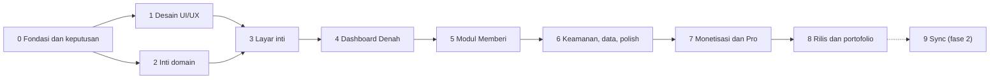

# Rizqflow — Roadmap

Breakdown proyek menjadi 10 tahap yang diselesaikan berurutan. **Status hidup ada di Notion**; dokumen ini adalah snapshot per 2026-09-21 untuk yang membaca kode langsung.

- Hub proyek: [Rizqflow di Ruang Finansial](https://app.notion.com/p/3e0edbb47c0b8184a091ddcf591766fd)
- Database tahap: [🧩 Tahap Rizqflow](https://app.notion.com/p/b5cf720718084e19a4cbb89a738c17ef)
- Database tugas dan log: [🚀 Pengembangan Rizqflow](https://app.notion.com/p/508597e5fd2c4424b9002c1956f02c5c)

Catatan progres dilakukan lewat skill `pengembangan-rizqflow` (lihat [CLAUDE.md](../CLAUDE.md)).

## Urutan dan ketergantungan

- Platform: **Android saja**, rilis di Google Play Store. Stack: **Kotlin + Jetpack Compose + Room** (2026-09-19).
- Arah visual: **opsi A**, pakai ulang identitas homepage roziqrizal.com (2026-09-19).
- Detail stack **disetujui 2026-09-20**: tiga modul Gradle (`:domain`, `:data`, `:app`), min SDK 26, DI manual, backup AES-GCM, tanpa SQLCipher untuk v1 (lihat [konsep.md](konsep.md)).
- Tahap 1 (desain) dan Tahap 2 (inti domain) bisa berjalan paralel setelah Tahap 0 selesai.
- Tahap 9 sengaja opsional: mulai hanya bila ada sinyal kebutuhan dari pengguna nyata.

## Tahap 0 — Fondasi dan keputusan (In Progress)

Menetapkan keputusan yang menentukan arah teknis dan bisnis sebelum kode ditulis.

- [x] Diskusi konsep, posisi produk, dan nama Rizqflow
- [x] Buat repo dan dokumen konsep awal
- [x] Rumuskan model bisnis freemium ([monetisasi.md](monetisasi.md))
- [x] Susun breakdown tahap, spesifikasi layar, dan flow UI
- [x] Pasang tracking Notion, skill `pengembangan-rizqflow`, dan CLAUDE.md repo
- [x] Putuskan platform: Android saja, rilis di Play Store (2026-09-19)
- [x] Putuskan stack Android: Kotlin + Jetpack Compose + Room (2026-09-19)
- [x] Setujui detail stack Android: modul, min SDK 26, DI manual, enkripsi (2026-09-20)
- [ ] Cek ketersediaan nama (Play Store, domain, GitHub, Google). Hasil awal 2026-09-20 di [konsep.md](konsep.md): Rizqflow layak, Rizqly bukan cadangan yang baik; tinggal cek manual Play Store, kepemilikan rizqflow.com, dan merek DJKI
- [x] Putuskan sumber harga emas: input manual (gratis), otomatis lewat API (Pro); riset API dilakukan di Tahap 7 (2026-09-20)
- [x] Putuskan kalender Hijriyah untuk haul: Umm al-Qura di balik antarmuka `HijriCalendar`; hisab Al-Kaukaba bisa menyusul (2026-09-21)
- [x] Tetapkan asumsi fikih default zakat mal: 85 g emas, 2,5%, haul 1 tahun Hijriyah (2026-09-20); default sementara, menunggu verifikasi kitab oleh pemilik
- [ ] Validasi minat lewat landing page dan daftar tunggu

## Tahap 1 — Desain UI/UX (Selesai)

Spesifikasi teks sudah ada di [ui-flow.md](ui-flow.md); tahap ini mengubahnya menjadi desain visual.

- [x] Putuskan arah visual: opsi A, pakai ulang identitas homepage (2026-09-19)
- [x] Tetapkan design tokens dan komponen dasar ([design/tokens.css](design/tokens.css))
- [x] Wireframe seluruh layar (S01–S28), termasuk keadaan kosong ([wireframe.md](wireframe.md), 2026-09-21)
- [x] Hi-fi layar kunci: Denah, Catat + Pratinjau alokasi, Detail ruang, Kartu haul (prototipe HTML di [design/](design/README.md); disetujui pemilik 2026-09-20)
- [x] Prototipe klik untuk flow F1–F9 dan seluruh layar S01–S28 (2026-09-21); pembayaran, izin, dan notifikasi tetap disimulasikan
- [x] Uji prototipe dengan pola data nyata dari Transaksi Harian di Ruang Finansial (2026-09-21): dua perbaikan tata letak di teks 200% dan temuan model data (lihat [design/README.md](design/README.md) dan [model-data.md](model-data.md))

## Tahap 2 — Inti domain, tanpa UI (In Progress)

Logika bisnis yang benar dan teruji sebelum ada layar.

- [x] Rancang model data dan skema penyimpanan lokal: [model-data.md](model-data.md), skema Room versi 1 di `:data` dengan berkas skema JSON (2026-09-21)
- [x] Value object Money (bilangan bulat, aritmetika eksak) (2026-09-20)
- [x] Aturan pembulatan alokasi: metode sisa terbesar, prioritas sebagai pemutus seri (2026-09-21)
- [x] Rule engine alokasi persentase: `AllocationEngine`, basis point, 20 tes (2026-09-21)
- [x] Definisikan arti "terpenuhi" per tipe ruang, ambang 85% untuk Mencukupi (2026-09-20, lihat [konsep.md](konsep.md))
- [x] Strategi modul Memberi: `zakat-haul-hijri` dan `percentage` (2026-09-21)
- [x] Kalkulator nisab dan haul Hijriyah, dengan dua kebijakan haul yang bisa diganti (2026-09-21)
- [x] Strategi unit test domain: [strategi-unit-test.md](strategi-unit-test.md), ditulis dari nol (2026-09-21)
- [x] Stub lapisan entitlement: `Entitlements`, `Feature`, `Plan`, `PlanEntitlements` (2026-09-21)
- [x] Setup proyek Android: modul domain terpisah, unit test, CI dasar (2026-09-20; CI pertama di GitHub hijau, 2026-09-20)

**Selesai bila:** unit test hijau untuk alokasi, nisab, dan haul (termasuk kasus tepi); tidak ada floating point untuk uang; skema penyimpanan punya jalur migrasi.

**Status 2026-09-21:** semua kriteria terpenuhi (82 tes domain hijau, skema Room versi 1 dengan berkas skema JSON dan larangan migrasi destruktif). Yang tersisa hanya dua tugas infrastruktur milik pengguna: memperbarui Android Studio dan memasang image emulator API 37.

## Tahap 3 — Layar inti: onboarding, catat, transaksi (In Progress)

- [x] Tema Compose dari design tokens (warna terang dan gelap, font Manrope dan Libre Caslon Text, warna ruang dan status) dan kerangka navigasi (bottom nav empat tab, tombol Catat) (2026-09-21)
- [x] Splash dan halaman masuk dengan Google dan Gmail (S29, S30), riwayat masuk, dan ikon aplikasi (2026-09-21); tombol Google butuh client ID dari Google Cloud milik pemilik ([auth-google.md](auth-google.md))
- [x] Masuk dengan nama pengguna dan sandi serta halaman Daftar (S30, S31): akun lokal dengan hash PBKDF2, tanpa server (2026-09-21)
- [ ] Onboarding (S01–S04; S01 digantikan S30)
- [ ] Catat transaksi (S06)
- [ ] Pratinjau alokasi (S07)
- [ ] Daftar transaksi dan detail/edit (S08–S09)
- [ ] Daftar ruang, aturan alokasi, kelola akun, kategori, dan favorit (S10, S12, S13)
- [ ] Catat kilat dan favorit (S24): pintasan ikon dan tile Quick Settings
- [ ] Mode demo dengan data contoh (S22)

**Selesai bila:** flow F1–F4 berjalan end-to-end tanpa jaringan; data bertahan; setiap layar punya empty state.

## Tahap 4 — Dashboard Denah (Backlog)

- [ ] Denah: ringkasan, grid ruang, perlu perhatian (S05)
- [ ] Detail ruang (S11)
- [ ] Logika status ruang per tipe dan tesnya
- [ ] State tepi: bulan kosong, banyak ruang, font besar, mode gelap

**Selesai bila:** status benar untuk ketiga tipe ruang; semua state punya tampilan; terbaca di font 200% dan mode gelap.

## Tahap 5 — Modul Memberi: zakat dan haul (Backlog)

Pembeda utama produk.

- [ ] Beranda Zakat dan profil harta (S14–S15)
- [ ] Kartu haul dan rincian perhitungan (S16)
- [ ] Tunaikan zakat menjadi transaksi (S17)
- [ ] Pengingat haul (notifikasi)
- [ ] Mode alternatif persentase donasi
- [ ] Tes kasus tepi haul dan nisab
- [ ] Disclaimer dan tampilan sumber fikih (S23)

**Selesai bila:** flow F5 berjalan end-to-end termasuk reset haul; asumsi fikih dan disclaimer tampil; modul bisa dimatikan tanpa merusak aplikasi.

## Tahap 6 — Keamanan, data, dan polish (Backlog)

- [ ] Kunci PIN dan biometrik (S19)
- [ ] Backup dan restore terenkripsi (S20)
- [ ] Ekspor CSV
- [ ] Impor CSV dari Transaksi Harian Notion
- [ ] Mode gelap, skala font, aksesibilitas
- [ ] Lokalisasi Indonesia dan Inggris
- [ ] Pengingat malam dengan balasan langsung dan tindakan "Tidak ada" (S26)
- [ ] Koreksi saldo (S25) dan petunjuk hari kosong di daftar transaksi

**Selesai bila:** PIN/biometrik tidak bisa dilewati; backup lalu restore di perangkat lain menghasilkan data identik; koreksi saldo mencatat selisih dengan benar untuk akun tunai, e-wallet, dan bank.

## Tahap 7 — Monetisasi dan Pro (Backlog)

- [ ] Integrasi pembelian (Google Play Billing) dan pulihkan pembelian
- [ ] Paywall bottom sheet dan titik penguncian (S21)
- [ ] Pro: ruang peran tak terbatas dan sistem per peran
- [ ] Pro: aturan alokasi lanjutan
- [ ] Pro: multi-profil haul dan harga emas otomatis
- [ ] Pro: laporan dan insight, multi-mata uang, widget, tema
- [ ] Uji alur pembelian dengan penguji lisensi

**Selesai bila:** semua penguncian lewat satu lapisan entitlement; akses tidak hilang setelah pasang ulang atau ganti perangkat.

## Tahap 8 — Rilis dan portofolio (Backlog)

- [ ] Akun developer, profil pembayaran, dan pajak
- [ ] Kebijakan privasi, deklarasi fitur finansial, dan data safety
- [ ] Uji tertutup Play Console (cek syaratnya sejak awal; memengaruhi jadwal)
- [ ] Store listing
- [ ] Case study di roziqrizal.com, README Inggris, video demo

## Tahap 9 — Fase 2: Sync dan ruang keluarga (Backlog, opsional)

- [ ] Riset arsitektur sync terenkripsi end-to-end dan biaya
- [ ] Ruang keluarga bersama
- [ ] Langganan Sync dan backend minimal

Jangan dimulai sebelum Pro terbit dan ada sinyal bahwa pengguna memang butuh berbagi data antar-perangkat atau antar-anggota keluarga.

## Versi 1.1 setelah rilis: tangkap otomatis (Pro)

Disetujui 2026-09-20; rancangan dan batasannya ada di "Disiplin mencatat" di [konsep.md](konsep.md). Tidak masuk 10 tahap di atas dan tidak menunda rilis pertama.

- [ ] Riset kebijakan Play Store untuk akses notifikasi (deklarasi, data safety, kebijakan data pengguna)
- [ ] Parser notifikasi per aplikasi, dimulai dari aplikasi yang paling sering dipakai, dengan unit test memakai contoh teks
- [ ] Layar Draf dan Tangkap otomatis (S27, S28)
- [ ] Deteksi transaksi ganda ("Mungkin sudah dicatat")
- [ ] Penguncian lewat lapisan entitlement (Pro)
