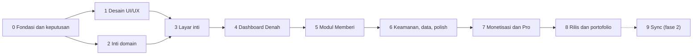

# Rizqflow — Roadmap

Breakdown proyek menjadi 10 tahap yang diselesaikan berurutan. **Status hidup ada di Notion**; dokumen ini adalah snapshot per 2026-09-19 untuk yang membaca kode langsung.

- Hub proyek: [Rizqflow di Ruang Finansial](https://app.notion.com/p/3e0edbb47c0b8184a091ddcf591766fd)
- Database tahap: [🧩 Tahap Rizqflow](https://app.notion.com/p/b5cf720718084e19a4cbb89a738c17ef)
- Database tugas dan log: [🚀 Pengembangan Rizqflow](https://app.notion.com/p/508597e5fd2c4424b9002c1956f02c5c)

Catatan progres dilakukan lewat skill `pengembangan-rizqflow` (lihat [CLAUDE.md](../CLAUDE.md)).

## Urutan dan ketergantungan

- **Blocker utama saat ini: keputusan platform** (Android native atau web). Tahap 2 dan seterusnya bergantung padanya.
- Tahap 1 (desain) dan Tahap 2 (inti domain) bisa berjalan paralel setelah Tahap 0 selesai.
- Tahap 9 sengaja opsional: mulai hanya bila ada sinyal kebutuhan dari pengguna nyata.

## Tahap 0 — Fondasi dan keputusan (In Progress)

Menetapkan keputusan yang menentukan arah teknis dan bisnis sebelum kode ditulis.

- [x] Diskusi konsep, posisi produk, dan nama Rizqflow
- [x] Buat repo dan dokumen konsep awal
- [x] Rumuskan model bisnis freemium ([monetisasi.md](monetisasi.md))
- [x] Susun breakdown tahap, spesifikasi layar, dan flow UI
- [x] Pasang tracking Notion, skill `pengembangan-rizqflow`, dan CLAUDE.md repo
- [ ] **Putuskan platform: Android native atau web** (Urgent)
- [ ] Cek ketersediaan nama (Play Store, domain, GitHub, Google); cadangan: Rizqly
- [ ] Riset sumber harga emas untuk nisab
- [ ] Putuskan kalender Hijriyah untuk haul (dan kemungkinan memakai ulang modul hisab Al-Kaukaba)
- [ ] Tetapkan asumsi fikih default zakat mal
- [ ] Validasi minat lewat landing page dan daftar tunggu

## Tahap 1 — Desain UI/UX (Planning)

Spesifikasi teks sudah ada di [ui-flow.md](ui-flow.md); tahap ini mengubahnya menjadi desain visual.

- [ ] Putuskan arah visual (pakai ulang identitas homepage atau baru)
- [ ] Tetapkan design tokens dan komponen dasar
- [ ] Wireframe seluruh layar MVP (S01–S23)
- [ ] Hi-fi layar kunci: Denah, Catat + Pratinjau alokasi, Detail ruang, Kartu haul
- [ ] Prototipe klik untuk flow F1–F5
- [ ] Uji prototipe dengan data nyata dari Transaksi Harian di Ruang Finansial

## Tahap 2 — Inti domain, tanpa UI (Backlog)

Logika bisnis yang benar dan teruji sebelum ada layar.

- [ ] Rancang model data dan skema penyimpanan lokal
- [ ] Value object Money (bilangan bulat) dan aturan pembulatan alokasi
- [ ] Rule engine alokasi persentase
- [ ] Definisikan arti "terpenuhi" per tipe ruang (lihat [konsep.md](konsep.md))
- [ ] Strategi modul Memberi: `zakat-haul-hijri` dan `percentage`
- [ ] Kalkulator nisab dan haul Hijriyah
- [ ] Strategi unit test domain (ikuti `docs/strategi-unit-test.md` di alkaukabaandroid)
- [ ] Stub lapisan entitlement

**Selesai bila:** unit test hijau untuk alokasi, nisab, dan haul (termasuk kasus tepi); tidak ada floating point untuk uang; skema penyimpanan punya jalur migrasi.

## Tahap 3 — Layar inti: onboarding, catat, transaksi (Backlog)

- [ ] Onboarding (S01–S04)
- [ ] Catat transaksi (S06)
- [ ] Pratinjau alokasi (S07)
- [ ] Daftar transaksi dan detail/edit (S08–S09)
- [ ] Daftar ruang, aturan alokasi, kelola akun dan kategori (S10, S12, S13)
- [ ] Mode demo dengan data contoh (S22)

**Selesai bila:** flow F1–F4 berjalan end-to-end tanpa jaringan; data bertahan; setiap layar punya empty state.

## Tahap 4 — Dashboard Denah (Backlog)

- [ ] Denah: ringkasan, grid ruang, perlu perhatian (S05)
- [ ] Detail ruang (S11)
- [ ] Logika status ruang per tipe dan tesnya
- [ ] State tepi: bulan kosong, banyak ruang, font besar, mode gelap

**Selesai bila:** status benar untuk ketiga tipe ruang; semua state punya tampilan; terbaca di font 200% dan mode gelap.

## Tahap 5 — Modul Memberi: zakat dan haul (Backlog)

Pembeda utama produk.

- [ ] Beranda Zakat dan profil harta (S14–S15)
- [ ] Kartu haul dan rincian perhitungan (S16)
- [ ] Tunaikan zakat menjadi transaksi (S17)
- [ ] Pengingat haul (notifikasi)
- [ ] Mode alternatif persentase donasi
- [ ] Tes kasus tepi haul dan nisab
- [ ] Disclaimer dan tampilan sumber fikih (S23)

**Selesai bila:** flow F5 berjalan end-to-end termasuk reset haul; asumsi fikih dan disclaimer tampil; modul bisa dimatikan tanpa merusak aplikasi.

## Tahap 6 — Keamanan, data, dan polish (Backlog)

- [ ] Kunci PIN dan biometrik (S19)
- [ ] Backup dan restore terenkripsi (S20)
- [ ] Ekspor CSV
- [ ] Impor CSV dari Transaksi Harian Notion
- [ ] Mode gelap, skala font, aksesibilitas
- [ ] Lokalisasi Indonesia dan Inggris

**Selesai bila:** PIN/biometrik tidak bisa dilewati; backup lalu restore di perangkat lain menghasilkan data identik.

## Tahap 7 — Monetisasi dan Pro (Backlog)

- [ ] Integrasi pembelian dan pulihkan pembelian
- [ ] Paywall bottom sheet dan titik penguncian (S21)
- [ ] Pro: ruang peran tak terbatas dan sistem per peran
- [ ] Pro: aturan alokasi lanjutan
- [ ] Pro: multi-profil haul dan harga emas otomatis
- [ ] Pro: laporan dan insight, multi-mata uang, widget, tema
- [ ] Uji alur pembelian dengan penguji lisensi

**Selesai bila:** semua penguncian lewat satu lapisan entitlement; akses tidak hilang setelah pasang ulang atau ganti perangkat.

## Tahap 8 — Rilis dan portofolio (Backlog)

- [ ] Akun developer, profil pembayaran, dan pajak
- [ ] Kebijakan privasi, deklarasi fitur finansial, dan data safety
- [ ] Uji tertutup Play Console (cek syaratnya sejak awal; memengaruhi jadwal)
- [ ] Store listing
- [ ] Case study di roziqrizal.com, README Inggris, video demo

## Tahap 9 — Fase 2: Sync dan ruang keluarga (Backlog, opsional)

- [ ] Riset arsitektur sync terenkripsi end-to-end dan biaya
- [ ] Ruang keluarga bersama
- [ ] Langganan Sync dan backend minimal

Jangan dimulai sebelum Pro terbit dan ada sinyal bahwa pengguna memang butuh berbagi data antar-perangkat atau antar-anggota keluarga.
