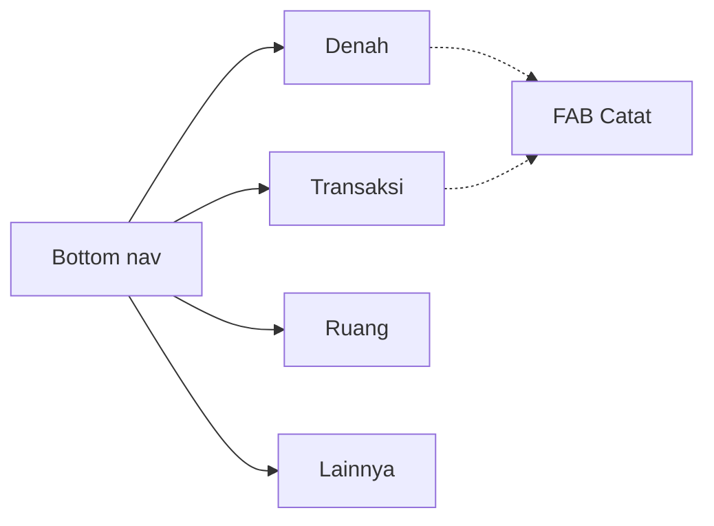
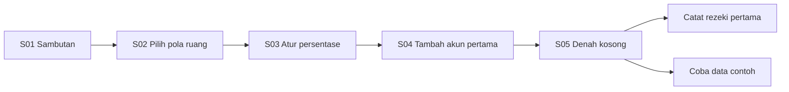
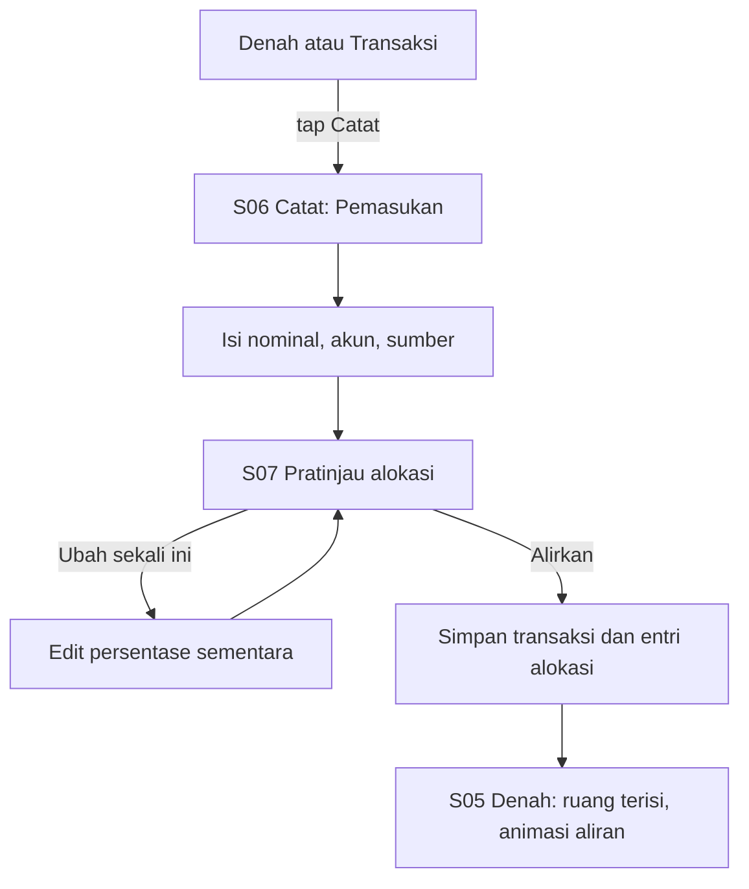
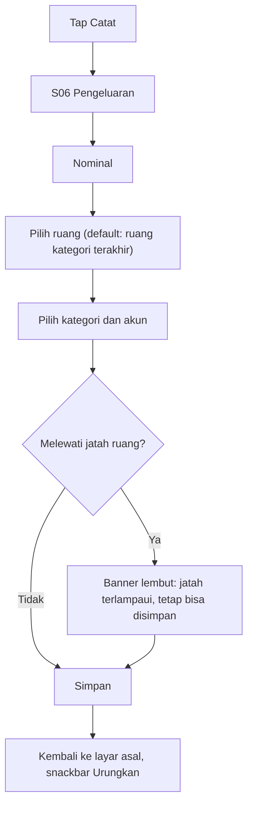
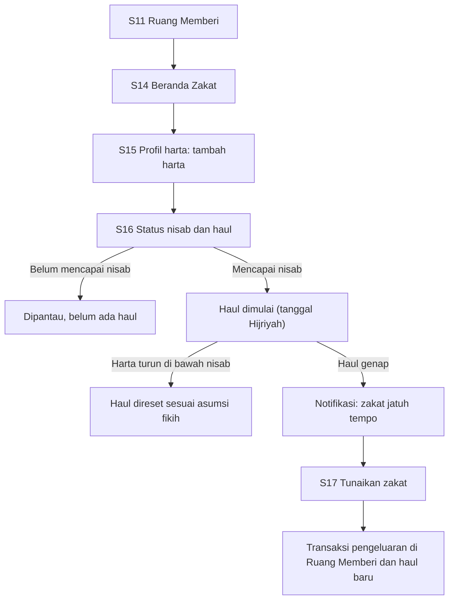
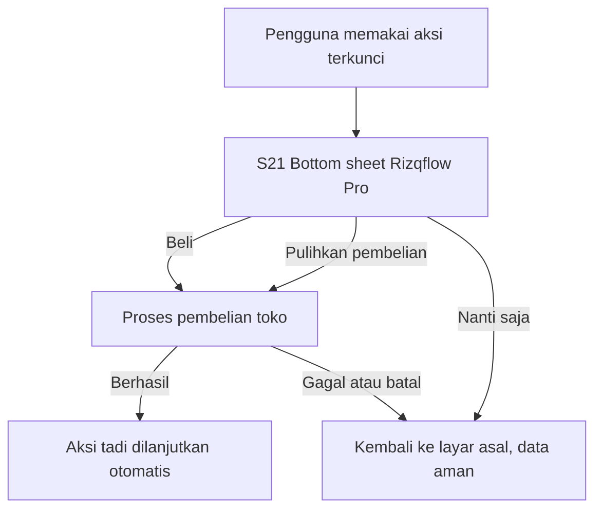
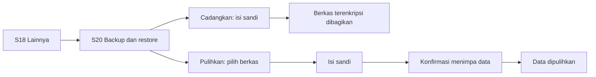

# Rizqflow — Layar dan Flow (UI)

Spesifikasi teks tampilan dan alur pengguna. **Belum desain visual**; ini bahan untuk Tahap 1 (lihat [roadmap.md](roadmap.md)).

- Platform: **Android** (diputuskan 2026-09-19). Pola di bawah mengikuti konvensi Android: bottom navigation, FAB, bottom sheet, snackbar.
- Semua angka pada wireframe hanya **contoh**, bukan saran keuangan.
- Kode layar (S01–S23) dan flow (F1–F7) dipakai bersama di Notion dan dokumen ini.

## Prinsip UI

1. **Tenang, bukan panik.** Peringatan bersifat lembut; layar tidak dibanjiri warna merah. Melewati jatah ruang tidak pernah memblokir pengguna.
2. **Satu tindakan utama per layar.**
3. **Angka besar dan terbaca.** Format `Rp 1.250.000`, angka tabular (lebar sama). Di kartu kecil boleh disingkat (`Rp 1,2 jt`), di detail selalu penuh.
4. **Jangan hanya andalkan warna.** Setiap status punya ikon dan label teks (aksesibilitas).
5. **Offline-first terlihat.** Tidak ada spinner jaringan; tampilkan bahwa data tersimpan di perangkat.
6. **Bahasa hangat, tanpa jargon.** Istilah baku: **Ruang**, **Jatah**, **Alirkan**, **Tunaikan**, **Rezeki**, **Denah**.

## Kerangka navigasi

Bottom navigation 4 tab, plus tombol **Catat** (FAB) yang selalu tersedia di Denah dan Transaksi.



## Komponen bersama

| Komponen | Dipakai di | Catatan |
|---|---|---|
| Kartu Ruang | S05 | Ikon, nama, cincin progres, sisa terhadap jatah, chip status |
| Cincin progres | S05, S11, S16 | Selalu disertai angka atau teks, bukan hanya gambar |
| Chip status | S05, S11 | Terpenuhi (centang), Berjalan (jam), Perlu perhatian (segitiga). Ikon plus teks |
| Bar bersegmen | S05, S07 | Satu segmen per ruang; segmen kosong untuk yang belum dialirkan |
| Numpad nominal | S06 | Tombol besar; pemisah ribuan otomatis |
| Bottom sheet | S21, pemilih | Tidak memutus alur |
| Snackbar Urungkan | S06, S08 | Setelah simpan atau hapus |
| Banner lembut | S06 | Untuk jatah terlampaui; tidak menghalangi simpan |
| Empty state | semua daftar | Satu kalimat dan satu ajakan bertindak |

## Inventaris layar

| Kode | Layar | Tujuan | Tahap |
|---|---|---|---|
| S01 | Sambutan | Tagline dan tombol Mulai | 3 |
| S02 | Pilih pola ruang | Template Tiga hak atau mulai kosong | 3 |
| S03 | Atur persentase alokasi | Slider dengan total selalu 100% | 3 |
| S04 | Tambah akun pertama | Nama akun dan saldo awal | 3 |
| S05 | Denah (beranda) | Jawab: apakah setiap hak sudah ditunaikan bulan ini? | 4 |
| S06 | Catat transaksi | Pemasukan, pengeluaran, transfer | 3 |
| S07 | Pratinjau alokasi | Menunjukkan rezeki masuk dialirkan ke ruang-ruang | 3 |
| S08 | Daftar transaksi | Per tanggal, filter, pencarian | 3 |
| S09 | Detail dan edit transaksi | Ubah atau hapus | 3 |
| S10 | Daftar ruang | Tambah, urutkan, arsipkan | 3 |
| S11 | Detail ruang | Jatah vs terpakai, pos, transaksi terbaru | 4 |
| S12 | Aturan alokasi | Ubah persentase | 3 |
| S13 | Kelola akun dan kategori | CRUD sederhana | 3 |
| S14 | Beranda Zakat | Status nisab dan haul, riwayat | 5 |
| S15 | Profil harta | Harta dan pengurang | 5 |
| S16 | Kartu haul dan rincian | Progres haul, perhitungan, asumsi | 5 |
| S17 | Tunaikan zakat | Membuat transaksi zakat | 5 |
| S18 | Lainnya | Menu pengaturan | 6 |
| S19 | Keamanan | PIN, biometrik, kunci otomatis | 6 |
| S20 | Backup, restore, ekspor | Berkas terenkripsi, CSV | 6 |
| S21 | Rizqflow Pro (paywall) | Bottom sheet pembelian | 7 |
| S22 | Mode demo dan tampilan | Data contoh, tema | 3 dan 6 |
| S23 | Tentang dan disclaimer | Versi, privasi, asumsi fikih | 6 |

## Wireframe layar kunci

### S05 Denah (beranda)

```
+--------------------------------+
| Denah              < Sep 2026 >|
|                                |
| Rezeki bulan ini               |
| Rp 8.500.000                   |
| [#####|###|####|..]            |
| Belum dialirkan: Rp 1.200.000  |
|                                |
| Ruang                          |
| +-------------+ +-------------+|
| | Memberi     | | Diri        ||
| | (o) 40%     | | (o) 100%    ||
| | Sisa 300rb  | | Terpenuhi v ||
| | Berjalan    | |             ||
| +-------------+ +-------------+|
| +-------------+ +-------------+|
| | Keluarga    | | + Ruang     ||
| | (o) 85%     | |   baru      ||
| | Perlu       | |             ||
| | perhatian ! | |             ||
| +-------------+ +-------------+|
|                                |
| Perlu perhatian                |
| ! Haul zakat 12 hari lagi      |
| ! Keluarga hampir lewat jatah  |
|                     [ + Catat ]|
+--------------------------------+
| Denah  Transaksi  Ruang  Lainnya|
+--------------------------------+
```

- Kartu ringkasan: total rezeki bulan ini dan nominal yang belum dialirkan.
- Grid ruang 2 kolom. Kesan denah datang dari tata letak ruang, bukan ilustrasi denah harfiah (lebih mudah dipakai saat ruangnya banyak).
- "Perlu perhatian" maksimal 3 butir: haul mendekati, ruang hampir melewati jatah, pemasukan belum dialirkan.
- Tanggal Hijriyah kecil di header bila modul Memberi aktif.

### S06 Catat transaksi (tab Pengeluaran)

```
+--------------------------------+
| x   Catat                      |
| [Pemasukan][Pengeluaran][Trf]  |
|                                |
|            Rp                  |
|          150.000               |
|                                |
| Ruang     [Keluarga      v]    |
| Kategori  [Belanja bulanan v]  |
| Akun      [Bank Jago     v]    |
| Tanggal   [Hari ini      v]    |
| Catatan   [Belanja pasar   ]   |
|                                |
| Terakhir: (Belanja) (Listrik)  |
|                                |
| [ 1 ] [ 2 ] [ 3 ]              |
| [ 4 ] [ 5 ] [ 6 ]              |
| [ 7 ] [ 8 ] [ 9 ]              |
| [000] [ 0 ] [ < ]              |
|                                |
| [ Simpan ]   Simpan + tambah   |
+--------------------------------+
```

- Tab **Pemasukan**: field Ruang diganti Sumber (Gaji, Usaha, Lainnya) dan Akun tujuan; tombol utama menuju S07, bukan langsung simpan.
- Ruang default mengikuti ruang dari kategori yang terakhir dipakai.
- Numpad memakai tombol `000` sebagai ganti koma, karena rupiah tidak memakai desimal.
- Melewati jatah ruang: banner lembut di atas tombol Simpan, tombol tetap aktif.

### S07 Pratinjau alokasi

```
+--------------------------------+
| <  Alirkan rezeki              |
|                                |
| Gaji September                 |
| Rp 8.500.000                   |
|                                |
| [########|#####|##########]   |
|  Memberi   Diri   Keluarga     |
|                                |
| Memberi    10%  Rp   850.000   |
| Diri       30%  Rp 2.550.000   |
| Keluarga   60%  Rp 5.100.000   |
| ------------------------------ |
| Belum dialirkan  Rp         0  |
|                                |
| Ubah sekali ini          [ ]   |
|                                |
| [          Alirkan          ]  |
+--------------------------------+
```

- Ini inti produk: pengguna melihat rezeki mengalir ke hak-hak sebelum menyimpan.
- **Ubah sekali ini** membuka persentase yang bisa disunting hanya untuk transaksi ini; aturan tetap tidak berubah.
- Jika total persentase kurang dari 100%, sisa tampil jelas di baris "Belum dialirkan".
- Persentase di contoh (10/30/60) hanya usulan awal template Tiga hak dan bisa diubah; bukan nasihat keuangan.

### S11 Detail ruang

```
+--------------------------------+
| < Keluarga                     |
|          (  85%  )             |
|   Terpakai Rp 2.550.000        |
|   dari jatah Rp 3.000.000      |
|                                |
| Pos                            |
| Belanja bulanan  [######..] 80%|
| Listrik dan air  [####....] 55%|
| Sekolah          [#########]100|
|                                |
| Transaksi terbaru              |
| 18 Sep  Belanja pasar   -150rb |
| 17 Sep  Token listrik   -200rb |
|                                |
| [ Atur aturan ]                |
+--------------------------------+
```

- Khusus ruang Memberi: ada kartu Zakat yang menuju S14.

### S16 Kartu haul

```
+--------------------------------+
| < Zakat mal                    |
|                                |
|        ( Hari ke-117 )         |
|           dari 354             |
|                                |
| Haul berjalan                  |
| Mulai        1 Muharram 1448   |
| Jatuh tempo  1 Muharram 1449   |
|                                |
| Harta bersih    Rp 152.000.000 |
| Nisab hari ini  Rp 141.100.000 |
| (85 g x Rp 1.660.000 per g)    |
| Di atas nisab  v               |
|                                |
| > Lihat rincian perhitungan    |
|                                |
| Asumsi: nisab 85 g emas, 2,5%, |
| haul 1 tahun Hijriyah.         |
| Bantuan hitung, bukan fatwa.   |
+--------------------------------+
```

- Harga emas dan tanggal pada contoh hanya ilustrasi. Di aplikasi, tampilkan sumber dan tanggal harga.
- Setiap tanggal Hijriyah disertai padanan Masehi (metode kalender: keputusan terbuka).

### S21 Rizqflow Pro (paywall)

```
+--------------------------------+
|   (layar di belakang, redup)   |
+================================+
|  Rizqflow Pro                  |
|                                |
|  v Ruang peran tak terbatas    |
|  v Aturan alokasi lanjutan     |
|  v Multi-profil zakat          |
|                                |
|  Rp 129.000   sekali bayar     |
|  Tanpa langganan               |
|                                |
|  [          Beli          ]    |
|  Pulihkan pembelian            |
|  Nanti saja                    |
|                                |
|  Fitur dasar dan zakat tetap   |
|  gratis.                       |
+================================+
```

- Bottom sheet, bukan layar penuh. Tiga manfaat yang tampil dipilih sesuai aksi yang memicu.
- Harga pada contoh hanya placeholder dalam kisaran uji (lihat [monetisasi.md](monetisasi.md)).

## Flow

### F1 Pertama kali membuka aplikasi



- S01: tagline dan satu tombol Mulai, tanpa slide berlapis.
- S02: kartu **Tiga hak** (Memberi, Diri, Keluarga) atau **Mulai kosong**; bisa dilewati dan diubah nanti.
- S03: slider dengan total selalu 100%; tampilkan hasil untuk contoh Rp 1.000.000 supaya konkret.
- S04: nama akun (bank, dompet digital, tunai) dan saldo awal.
- S05 kosong menawarkan dua jalan: catat rezeki pertama, atau coba data contoh (mode demo).

### F2 Rezeki masuk, dialirkan otomatis



### F3 Pengeluaran



### F4 Mengubah aturan alokasi

S10 Daftar ruang, lalu S12 Aturan alokasi, lalu ubah persentase. Total harus 100%; tombol Simpan nonaktif bila tidak. Berlaku untuk pemasukan berikutnya, riwayat tidak berubah.

### F5 Dari harta sampai zakat ditunaikan



- S14: kartu status besar (Belum mencapai nisab, Haul berjalan, Haul genap), nisab hari ini dengan sumber dan tanggal harga, total harta bersih, riwayat zakat.
- S15: harta (emas dalam gram, uang dan tabungan, investasi, piutang lancar) dan pengurang (hutang jangka pendek); pengingat rutin untuk memperbarui nilai.
- S17: jumlah zakat (2,5% dari harta bersih, bisa diubah), akun sumber, konfirmasi. Hasilnya transaksi pengeluaran kategori Zakat mal di ruang Memberi.
- Mode alternatif **Persentase donasi** untuk yang tidak memakai modul zakat: tanpa nisab dan haul.

### F6 Membuka fitur Pro



### F7 Backup dan restore



- Pulihkan selalu meminta konfirmasi eksplisit bahwa data sekarang akan tertimpa.
- Sandi salah atau berkas rusak: pesan jelas, data sekarang tidak disentuh.

## Tipe ruang dan status

Status di Denah bergantung pada **tipe ruang** (Menunaikan, Menumbuhkan, Mencukupi). Definisi dan usulannya ada di [konsep.md](konsep.md); ini keputusan yang perlu dikonfirmasi sebelum logika status dibuat.

## State dan kasus tepi

| Situasi | Perilaku |
|---|---|
| Denah tanpa data | Empty state: satu kalimat dan dua ajakan (catat rezeki pertama, coba data contoh) |
| Ruang baru tanpa jatah | Tampil netral (bukan Perlu perhatian) sampai ada pemasukan |
| Lebih dari 6 ruang | Grid bisa digulir; tetap 2 kolom |
| Nominal sangat besar | Singkat di kartu (Rp 1,2 M), penuh di detail |
| Font 200% | Kartu berubah menjadi 1 kolom; tidak ada teks terpotong |
| Persentase tidak berjumlah 100% | Tombol Simpan nonaktif, tampilkan selisihnya |
| Sandi restore salah | Pesan jelas, tidak menyentuh data |
| Pembelian gagal atau batal | Kembali ke layar asal, tidak ada perubahan data |
| Mode demo aktif | Penanda jelas di header; data demo tidak tercampur dengan data asli |

## Arah visual (diputuskan: opsi A)

**Diputuskan 2026-09-19: opsi A.** Rizqflow memakai ulang identitas homepage roziqrizal.com: palet sage Material 3 (nama peran warnanya sama dengan Material 3, jadi langsung dipetakan ke `ColorScheme` Compose), Manrope untuk UI dan angka, Libre Caslon Text untuk judul layar dan judul bagian. Opsi B (identitas baru) ditolak untuk versi pertama; kalau nanti ingin pindah, cukup mengganti design tokens.

Aturan turunan:

- Semua warna dan font disimpan sebagai **design tokens**, bukan ditulis langsung di layar.
- **Angka besar selalu Manrope**, bukan serif: hero "Rezeki bulan ini", nilai di cincin progres, dan nominal di kartu. Libre Caslon hanya untuk judul.
- Status tidak boleh bergantung pada warna saja (apalagi merah/hijau): selalu ikon plus teks.
- **Warna identitas ruang** (bar alokasi, cincin) diambil dari palet data yang divalidasi, bukan dari palet sage untuk chrome, karena sage terlalu pucat untuk membedakan tiga ruang.
- **Teks besar ikut skala pengguna**, kecuali angka hero (dibatasi 1,25x) dan label navigasi (1,3x); kartu ruang menjadi 1 kolom di 150% ke atas.

Token dan prototipe klik untuk layar kunci ada di [design/README.md](design/README.md).
