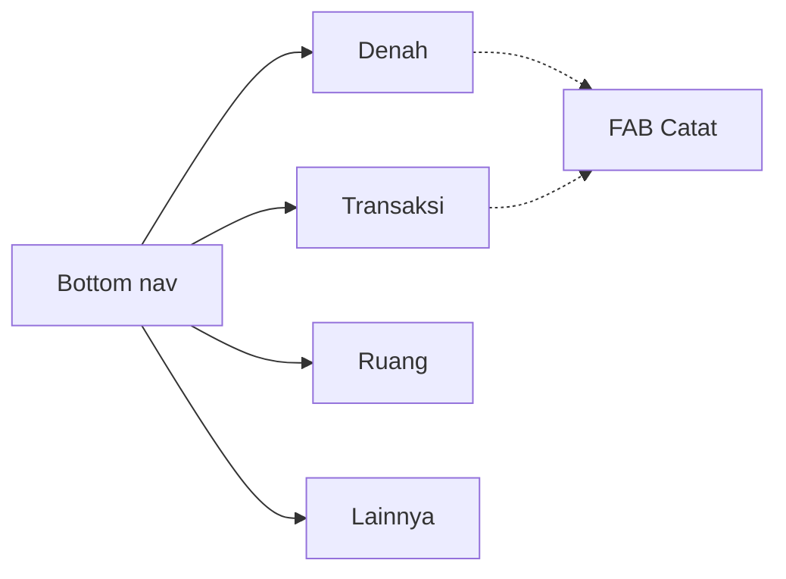
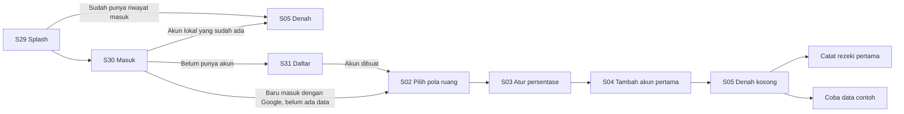
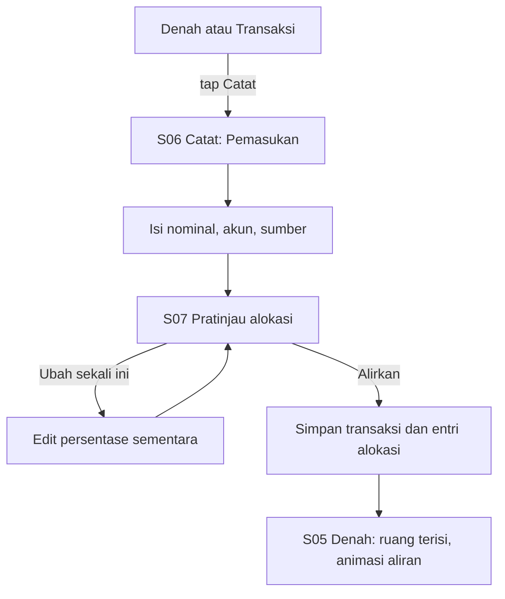
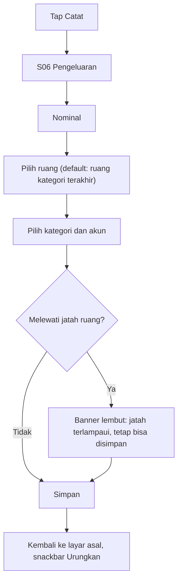
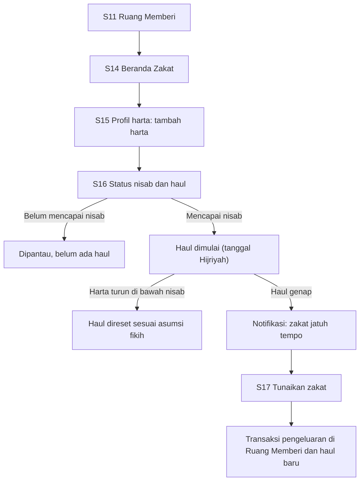
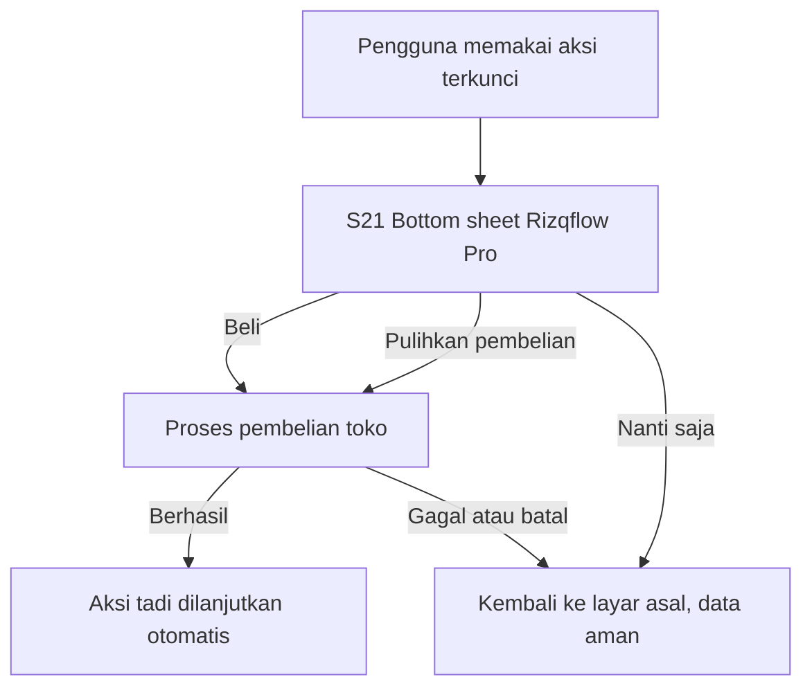
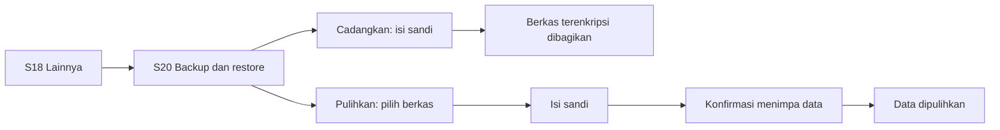
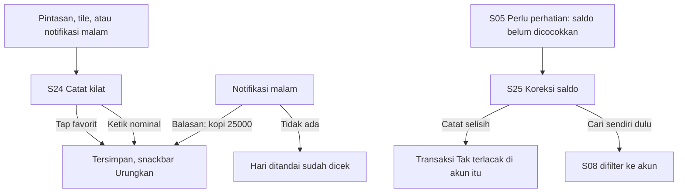
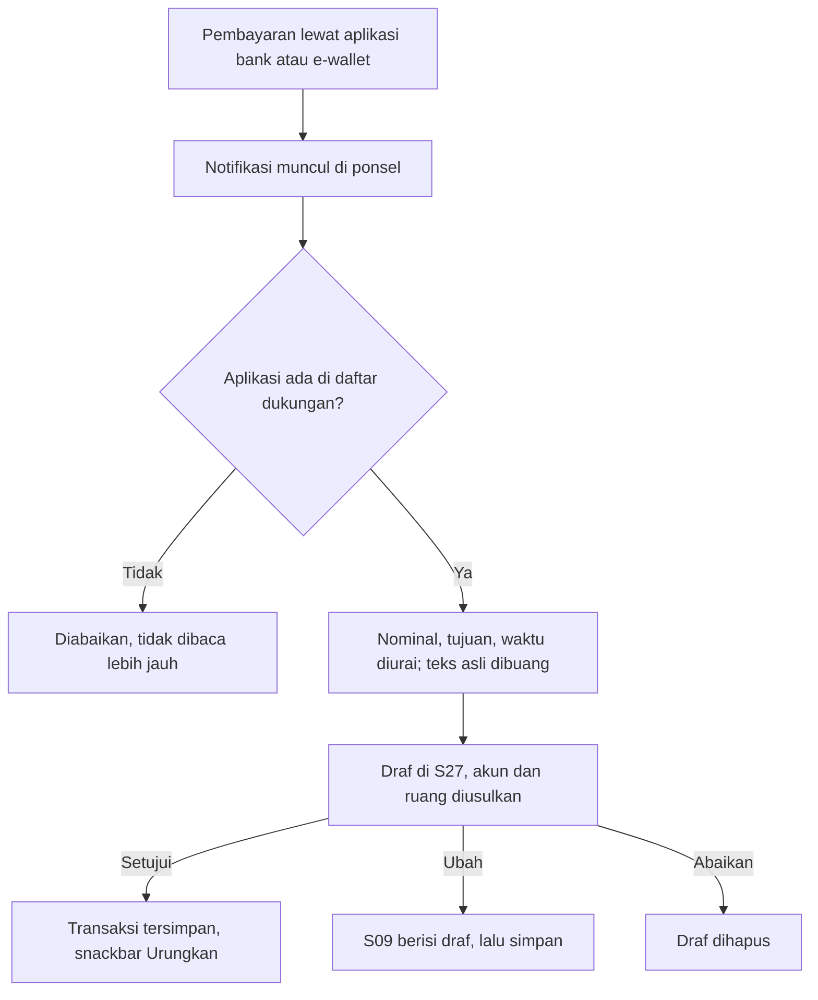

# Rizqflow — Layar dan Flow (UI)

Spesifikasi teks tampilan dan alur pengguna. Tata letak seluruh layar ada di [wireframe.md](wireframe.md), dan prototipe klik untuk layar kunci di [design/](design/README.md) (lihat [roadmap.md](roadmap.md) untuk tahapnya).

- Platform: **Android** (diputuskan 2026-09-19). Pola di bawah mengikuti konvensi Android: bottom navigation, FAB, bottom sheet, snackbar.
- Semua angka pada wireframe hanya **contoh**, bukan saran keuangan.
- Kode layar (S01–S28) dan flow (F1–F9) dipakai bersama di Notion dan dokumen ini.

## Prinsip UI

1. **Tenang, bukan panik.** Peringatan bersifat lembut; layar tidak dibanjiri warna merah. Melewati jatah ruang tidak pernah memblokir pengguna.
2. **Satu tindakan utama per layar.**
3. **Angka besar dan terbaca.** Format `Rp 1.250.000`, angka tabular (lebar sama). Di kartu kecil boleh disingkat (`Rp 1,2 jt`), di detail selalu penuh.
4. **Jangan hanya andalkan warna.** Setiap status punya ikon dan label teks (aksesibilitas).
5. **Offline-first terlihat.** Tidak ada spinner jaringan; tampilkan bahwa data tersimpan di perangkat.
6. **Bahasa hangat, tanpa jargon.** Istilah baku: **Ruang**, **Jatah**, **Alirkan**, **Tunaikan**, **Rezeki**, **Denah**.

## Kerangka navigasi

Bottom navigation 4 tab, plus tombol **Catat** (FAB) yang selalu tersedia di Denah dan Transaksi.



## Komponen bersama

| Komponen | Dipakai di | Catatan |
|---|---|---|
| Kartu Ruang | S05 | Ikon, nama, cincin progres, sisa terhadap jatah, chip status |
| Cincin progres | S05, S11, S16 | Selalu disertai angka atau teks, bukan hanya gambar |
| Chip status | S05, S11 | Terpenuhi (centang), Berjalan (jam), Perlu perhatian (segitiga). Ikon plus teks |
| Bar bersegmen | S05, S07 | Satu segmen per ruang; segmen kosong untuk yang belum dialirkan |
| Numpad nominal | S06 | Tombol besar; pemisah ribuan otomatis |
| Bottom sheet | S21, pemilih | Tidak memutus alur |
| Snackbar Urungkan | S06, S08 | Setelah simpan atau hapus |
| Banner lembut | S06 | Untuk jatah terlampaui; tidak menghalangi simpan |
| Empty state | semua daftar | Satu kalimat dan satu ajakan bertindak |
| Chip favorit | S24, S06 | Nama dan nominal; satu ketukan menyimpan |
| Balasan notifikasi | Notifikasi malam | Kolom balasan dan tindakan "Tidak ada" |

## Inventaris layar

| Kode | Layar | Tujuan | Tahap |
|---|---|---|---|
| S01 | Sambutan | Tagline dan tombol Mulai | 3 |
| S02 | Pilih pola ruang | Template Tiga hak atau mulai kosong | 3 |
| S03 | Atur persentase alokasi | Slider dengan total selalu 100% | 3 |
| S04 | Tambah akun pertama | Nama akun dan saldo awal | 3 |
| S05 | Denah (beranda) | Jawab: apakah setiap hak sudah ditunaikan bulan ini? | 4 |
| S06 | Catat transaksi | Pemasukan, pengeluaran, transfer | 3 |
| S07 | Pratinjau alokasi | Menunjukkan rezeki masuk dialirkan ke ruang-ruang | 3 |
| S08 | Daftar transaksi | Per tanggal, filter, pencarian | 3 |
| S09 | Detail dan edit transaksi | Ubah atau hapus | 3 |
| S10 | Daftar ruang | Tambah, urutkan, arsipkan | 3 |
| S11 | Detail ruang | Jatah vs terpakai, pos, transaksi terbaru | 4 |
| S12 | Aturan alokasi | Ubah persentase | 3 |
| S13 | Kelola akun, kategori, dan favorit | CRUD sederhana | 3 |
| S14 | Beranda Zakat | Status nisab dan haul, riwayat | 5 |
| S15 | Profil harta | Harta dan pengurang | 5 |
| S16 | Kartu haul dan rincian | Progres haul, perhitungan, asumsi | 5 |
| S17 | Tunaikan zakat | Membuat transaksi zakat | 5 |
| S18 | Lainnya | Menu pengaturan | 6 |
| S19 | Keamanan | PIN, biometrik, kunci otomatis | 6 |
| S20 | Backup, restore, ekspor | Berkas terenkripsi, CSV | 6 |
| S21 | Rizqflow Pro (paywall) | Bottom sheet pembelian | 7 |
| S22 | Mode demo dan tampilan | Data contoh, tema | 3 dan 6 |
| S23 | Tentang dan disclaimer | Versi, privasi, asumsi fikih | 6 |
| S24 | Catat kilat | Bottom sheet: nominal dan favorit, dari pintasan, tile, atau notifikasi | 3 |
| S25 | Koreksi saldo | Saldo sebenarnya per akun; selisih dicatat | 6 |
| S26 | Pengingat harian | Jam dan nada pengingat malam | 6 |
| S27 | Draf dari notifikasi | Setujui, ubah, atau abaikan draf transaksi | v1.1 |
| S28 | Tangkap otomatis | Penjelasan izin, aplikasi yang didukung, pemetaan ke akun (Pro) | v1.1 |
| S29 | Splash | Layar pembuka; menahan sampai riwayat masuk terbaca | 3 |
| S30 | Masuk | Nama pengguna dan sandi, Google connect, Gmail (opsional); menggantikan S01 Sambutan | 3 |
| S31 | Daftar | Membuat akun lokal (nama pengguna dan sandi), langsung masuk | 3 |
| S32 | Peran ruang | Trader (batas risiko per trade) atau Investor (jadwal DCA) untuk satu ruang; Pro | 7 |

## Wireframe layar kunci

Hanya sebagian layar ada di sini; wireframe semua layar S01–S28 (termasuk keadaan kosong) ada di [wireframe.md](wireframe.md).

### S05 Denah (beranda)

```
+--------------------------------+
| Denah              < Sep 2026 >|
|                                |
| Rezeki bulan ini               |
| Rp 8.500.000                   |
| [#####|###|####|..]            |
| Belum dialirkan: Rp 1.200.000  |
|                                |
| Ruang                          |
| +-------------+ +-------------+|
| | Memberi     | | Diri        ||
| | (o) 40%     | | (o) 100%    ||
| | Sisa 300rb  | | Terpenuhi v ||
| | Berjalan    | |             ||
| +-------------+ +-------------+|
| +-------------+ +-------------+|
| | Keluarga    | | + Ruang     ||
| | (o) 85%     | |   baru      ||
| | Perlu       | |             ||
| | perhatian ! | |             ||
| +-------------+ +-------------+|
|                                |
| Perlu perhatian                |
| ! Haul zakat 12 hari lagi      |
| ! Keluarga hampir lewat jatah  |
|                     [ + Catat ]|
+--------------------------------+
| Denah  Transaksi  Ruang  Lainnya|
+--------------------------------+
```

- Kartu ringkasan: total rezeki bulan ini dan nominal yang belum dialirkan.
- Grid ruang 2 kolom. Kesan denah datang dari tata letak ruang, bukan ilustrasi denah harfiah (lebih mudah dipakai saat ruangnya banyak).
- "Perlu perhatian" maksimal 3 butir: haul mendekati, ruang hampir melewati jatah, pemasukan belum dialirkan, saldo akun belum dicocokkan lebih dari 7 hari (menuju S25).
- Tanggal Hijriyah kecil di header bila modul Memberi aktif.
- Kartu **Sisa aman hari ini** di bawah kartu rezeki, hanya bulan berjalan dan bila ada ruang Mencukupi berjatah (rumus di [konsep.md](konsep.md)). Jatah hari ini terlampaui tampil Rp 0 dengan teks lembut, tanpa merah.

### S06 Catat transaksi (tab Pengeluaran)

```
+--------------------------------+
| x   Catat                      |
| [Pemasukan][Pengeluaran][Trf]  |
|                                |
|            Rp                  |
|          150.000               |
|                                |
| Ruang     [Keluarga      v]    |
| Kategori  [Belanja bulanan v]  |
| Akun      [Bank Jago     v]    |
| Tanggal   [Hari ini      v]    |
| Catatan   [Belanja pasar   ]   |
|                                |
| Terakhir: (Belanja) (Listrik)  |
|                                |
| [ 1 ] [ 2 ] [ 3 ]              |
| [ 4 ] [ 5 ] [ 6 ]              |
| [ 7 ] [ 8 ] [ 9 ]              |
| [000] [ 0 ] [ < ]              |
|                                |
| [ Simpan ]   Simpan + tambah   |
+--------------------------------+
```

- Tab **Pemasukan**: field Ruang diganti Sumber (Gaji, Usaha, Lainnya) dan Akun tujuan; tombol utama menuju S07, bukan langsung simpan.
- Ruang default mengikuti ruang dari kategori yang terakhir dipakai.
- Numpad memakai tombol `000` sebagai ganti koma, karena rupiah tidak memakai desimal.
- Pengeluaran yang sering berulang bisa ditandai **Jadikan favorit** (nominal, kategori, ruang, dan akun ikut tersimpan); favorit tampil sebagai chip di S24.
- Melewati jatah ruang: banner lembut di atas tombol Simpan, tombol tetap aktif.
- Pengeluaran baru bertanggal hari ini menampilkan baris **Sisa aman hari ini** di bawah nominal; setelah nominal diisi di ruang Mencukupi berubah menjadi **Sisa aman setelah ini** (tidak pernah negatif). Tidak tampil saat mengubah transaksi lama atau bertanggal selain hari ini.

### S07 Pratinjau alokasi

```
+--------------------------------+
| <  Alirkan rezeki              |
|                                |
| Gaji September                 |
| Rp 8.500.000                   |
|                                |
| [########|#####|##########]   |
|  Memberi   Diri   Keluarga     |
|                                |
| Memberi    10%  Rp   850.000   |
| Diri       30%  Rp 2.550.000   |
| Keluarga   60%  Rp 5.100.000   |
| ------------------------------ |
| Belum dialirkan  Rp         0  |
|                                |
| Ubah sekali ini          [ ]   |
|                                |
| [          Alirkan          ]  |
+--------------------------------+
```

- Ini inti produk: pengguna melihat rezeki mengalir ke hak-hak sebelum menyimpan.
- **Ubah sekali ini** membuka persentase yang bisa disunting hanya untuk transaksi ini; aturan tetap tidak berubah.
- Jika total persentase kurang dari 100%, sisa tampil jelas di baris "Belum dialirkan".
- Persentase di contoh (10/30/60) hanya usulan awal template Tiga hak dan bisa diubah; bukan nasihat keuangan.

### S11 Detail ruang

```
+--------------------------------+
| < Keluarga                     |
|          (  85%  )             |
|   Terpakai Rp 2.550.000        |
|   dari jatah Rp 3.000.000      |
|                                |
| Pos                            |
| Belanja bulanan  [######..] 80%|
| Listrik dan air  [####....] 55%|
| Sekolah          [#########]100|
|                                |
| Transaksi terbaru              |
| 18 Sep  Belanja pasar   -150rb |
| 17 Sep  Token listrik   -200rb |
|                                |
| [ Atur aturan ]                |
+--------------------------------+
```

- Khusus ruang Memberi: ada kartu Zakat yang menuju S14.

### S16 Kartu haul

```
+--------------------------------+
| < Zakat mal                    |
|                                |
|        ( Hari ke-117 )         |
|           dari 354             |
|                                |
| Haul berjalan                  |
| Mulai        1 Muharram 1448   |
| Jatuh tempo  1 Muharram 1449   |
|                                |
| Harta bersih    Rp 152.000.000 |
| Nisab hari ini  Rp 141.100.000 |
| (85 g x Rp 1.660.000 per g)    |
| Di atas nisab  v               |
|                                |
| > Lihat rincian perhitungan    |
|                                |
| Asumsi: nisab 85 g emas, 2,5%, |
| haul 1 tahun Hijriyah.         |
| Bantuan hitung, bukan fatwa.   |
+--------------------------------+
```

- Harga emas dan tanggal pada contoh hanya ilustrasi. Di aplikasi, tampilkan sumber dan tanggal harga.
- Setiap tanggal Hijriyah disertai padanan Masehi (metode kalender: keputusan terbuka).

### S21 Rizqflow Pro (paywall)

```
+--------------------------------+
|   (layar di belakang, redup)   |
+================================+
|  Rizqflow Pro                  |
|                                |
|  v Ruang peran tak terbatas    |
|  v Aturan alokasi lanjutan     |
|  v Multi-profil zakat          |
|                                |
|  Rp 129.000   sekali bayar     |
|  Tanpa langganan               |
|                                |
|  [          Beli          ]    |
|  Pulihkan pembelian            |
|  Nanti saja                    |
|                                |
|  Fitur dasar dan zakat tetap   |
|  gratis.                       |
+================================+
```

- Bottom sheet, bukan layar penuh. Tiga manfaat yang tampil dipilih sesuai aksi yang memicu.
- Harga pada contoh hanya placeholder dalam kisaran uji (lihat [monetisasi.md](monetisasi.md)).

### S24 Catat kilat

```
+--------------------------------+
|   (layar di belakang, redup)   |
+================================+
|  Catat kilat                   |
|                                |
|            Rp 25.000           |
|                                |
|  Favorit                       |
|  (Kopi 15rb)  (Parkir 3rb)     |
|  (Jajan 20rb) (Bensin 30rb)    |
|                                |
|  Akun  [Tunai            v]    |
|                                |
|  [ 1 ] [ 2 ] [ 3 ]             |
|  [ 4 ] [ 5 ] [ 6 ]             |
|  [ 7 ] [ 8 ] [ 9 ]             |
|  [000] [ 0 ] [ < ]             |
|                                |
|  [          Simpan          ]  |
+================================+
```

- Bottom sheet yang langsung terbuka dari pintasan ikon (tekan lama), tile Quick Settings, atau tindakan di notifikasi malam, tanpa melewati Denah.
- **Ketuk favorit langsung menyimpan** dengan nominal, kategori, ruang, dan akun favorit itu, lalu snackbar Urungkan. Satu ketukan.
- Nominal diketik manual: kategori dan ruang mengikuti yang terakhir dipakai, akun mengikuti akun terakhir.
- Hanya pengeluaran. Pemasukan tetap lewat S06 karena harus melewati S07.
- Baris **Sisa aman hari ini** di bawah nominal, berubah menjadi **Sisa aman setelah ini** saat nominal diketik dan ruang yang dipakai bertipe Mencukupi; sama dengan S06.
- Paling banyak 6 favorit tampil, urut dari yang paling sering dipakai. Favorit dibuat dari S06 dan dikelola di S13.

### S25 Koreksi saldo

```
+--------------------------------+
| <  Koreksi saldo               |
|                                |
| Akun          [Tunai        v] |
| Menurut catatan  Rp   312.000  |
| Saldo sebenarnya Rp [ 265.000 ]|
|                                |
| Selisih          Rp    47.000  |
| Belum tercatat sebagai         |
| pengeluaran.                   |
|                                |
| Catat sebagai                  |
| Kategori [Tak terlacak     v]  |
| Ruang    [Keluarga         v]  |
|                                |
| [       Catat selisih       ]  |
|   Cari sendiri dulu            |
+--------------------------------+
```

- Berlaku untuk semua jenis akun: tunai, e-wallet, bank. QRIS memotong saldo akun yang dipakai membayar, jadi ikut tercocokkan.
- Saldo sebenarnya lebih kecil dari catatan: selisih dicatat sebagai pengeluaran "Tak terlacak" (kategori sistem) di akun itu. Lebih besar: tawarkan pemasukan yang belum tercatat, bukan pengeluaran negatif. Sama: "Catatan cocok dengan saldo" dengan ikon centang.
- Nada netral ("Rp 47.000 belum tercatat"), tanpa kata yang menghakimi. Tombol tidak wajib; **Cari sendiri dulu** membuka S08 yang difilter ke akun itu.
- Jalan masuk: S18 Lainnya, atau butir "Perlu perhatian" di S05. Tidak punya notifikasi sendiri.
- Ruang tempat selisih dicatat: ruang dari pengeluaran terakhir di akun itu, dan bisa diubah di kolom Ruang. Bila akun belum punya pengeluaran, usulannya ruang bertipe Mencukupi. Selisih adalah transaksi biasa, jadi ikut dihitung dalam jatah ruang itu.

### S26 Pengingat harian

Pengaturan sederhana: pengingat malam **aktif secara bawaan** dan bisa dimatikan, jam pengingat, dan pratinjau teks notifikasi. Usulan: izin notifikasi Android 13+ diminta setelah transaksi pertama disimpan, bukan di awal onboarding. Bila izin notifikasi ditolak, layar ini menjelaskan singkat dan tidak meminta ulang berulang.

### S27 Draf dari notifikasi

Fitur v1.1 (Pro). Draf tampil sebagai baris "3 draf menunggu" di atas S08, dan sebagai daftar penuh di S27.

- Tiap draf menampilkan nominal, nama tujuan, waktu, aplikasi sumber, akun hasil pemetaan, dan ruang serta kategori usulan (mengikuti tujuan yang pernah dicatat, atau kategori terakhir).
- Tiga aksi: **Setujui** (satu ketukan, lalu snackbar Urungkan), **Ubah** (membuka S09 dengan isi draf), **Abaikan**.
- **Setujui semua** hanya untuk draf yang tidak bertanda "Mungkin sudah dicatat".
- Empty state: "Belum ada draf. Pembayaran digital berikutnya akan muncul di sini."

### S28 Tangkap otomatis

Fitur v1.1 (Pro), dibuka dari S18 Lainnya.

- Penjelasan singkat sebelum izin diminta: apa yang dibaca (hanya notifikasi dari aplikasi keuangan yang didukung), apa yang disimpan (nominal, tujuan, waktu, aplikasi), dan bahwa semuanya diproses di perangkat.
- Tombol menuju pengaturan sistem untuk akses notifikasi (Android tidak memakai dialog biasa untuk izin ini).
- Daftar aplikasi yang didukung dengan saklar per aplikasi dan pemetaan ke Akun (misalnya GoPay ke akun GoPay).
- Izin bisa dicabut kapan saja; draf dan transaksi yang sudah ada tidak berubah.

## Flow

### F1 Pertama kali membuka aplikasi



- S29 Splash lalu S30 Masuk (2026-09-21): splash menahan sampai riwayat masuk terbaca; tanpa riwayat tampil S30, dengan riwayat langsung ke Denah. S30 berisi tagline, tiga jaminan, tombol Google **berupa simbol G saja** (keputusan pemilik 2026-09-21; nama untuk pembaca layar tetap "Lanjutkan dengan Google"), dan tombol **Hubungkan Gmail** (opsional, izin baca). Kegagalan tampil sebagai pesan lembut, tidak memblokir. **S30 menggantikan S01**; teks S01 di bawah dipertahankan sebagai riwayat.
- Akun lokal (2026-09-21, permintaan pemilik): S30 juga punya kolom **nama pengguna dan sandi** dan tautan **Daftar** ke S31. Akun disimpan di ponsel ini saja (hash sandi, tanpa server); sandi tidak bisa dipulihkan. Salah sandi dan nama pengguna tak dikenal memberi pesan yang sama. Setelah daftar langsung masuk dan lanjut ke S02; masuk dengan akun yang sudah ada langsung ke Denah. Wireframe dan aturan lengkap ada di [wireframe.md](wireframe.md) (S30, S31).
- S01 (digantikan S30): tagline dan satu tombol Mulai, tanpa slide berlapis. Tautan teks **Pulihkan dari cadangan** untuk yang pindah ponsel (menuju F7).
- S02: kartu **Tiga hak** (Memberi, Diri, Keluarga) atau **Mulai kosong**; **Mulai kosong** sekaligus cara melewati langkah ini (S03 dilewati), dan pilihan bisa diubah nanti. Layar S02 sampai S04 menampilkan penghitung langkah.
- S03: slider dengan total selalu 100%: ruang terakhir menerima sisanya dan tidak punya slider; tampilkan hasil untuk contoh Rp 1.000.000 supaya konkret.
- S04: jenis akun (tunai, bank, dompet digital), nama akun (wajib), dan saldo awal (boleh nol). Saldo awal **bukan rezeki**: tidak masuk "Rezeki bulan ini" dan tidak dialirkan ke ruang.
- S05 kosong menawarkan dua jalan: catat rezeki pertama, atau coba data contoh (mode demo). Tanpa ruang (dari Mulai kosong), rezeki yang dicatat tersimpan sebagai "belum dialirkan" sampai ada ruang; Denah menawarkan Pakai pola Tiga hak.
- Mode demo memakai data terpisah: penanda di header, dan keluar dari demo mengembalikan data pengguna (S22).

### F2 Rezeki masuk, dialirkan otomatis



### F3 Pengeluaran



### F4 Mengubah aturan alokasi

S10 Daftar ruang, lalu S12 Aturan alokasi, lalu ubah persentase. Total harus 100%; tombol Simpan nonaktif bila tidak, dan juga bila belum ada perubahan. Berlaku untuk pemasukan berikutnya, riwayat tidak berubah.

- Jalan masuk: S10 (baris Pembagian rezeki), tombol Atur aturan di S11 (baris ruang itu disorot), atau S18 Lainnya.
- Keluar dengan perubahan yang belum disimpan menampilkan sheet "Buang perubahan?". Sesudah simpan: snackbar Urungkan.
- Baris **Aturan lanjutan** (prioritas, batas atas, sisa mengalir) terkunci Pro dan membuka S21.
- Rezeki yang tidak habis terbagi (total di bawah 100% pada Ubah sekali ini) tidak hilang: ia tersimpan sebagai "belum dialirkan" di Denah.

### F5 Dari harta sampai zakat ditunaikan



- S14: kartu status besar (Belum mencapai nisab, Haul berjalan, Haul genap), nisab hari ini dengan sumber dan tanggal harga, total harta bersih, riwayat zakat.
- S15: harta (emas dalam gram, uang dan tabungan, investasi, piutang lancar) dan pengurang (hutang jangka pendek); pengingat rutin untuk memperbarui nilai.
- S17: jumlah zakat (2,5% dari harta bersih, bisa diubah), akun sumber, konfirmasi. Hasilnya transaksi pengeluaran kategori Zakat mal di ruang Memberi.
- Mode alternatif **Persentase donasi** untuk yang tidak memakai modul zakat: tanpa nisab dan haul.

### Keputusan tambahan dari melengkapi prototipe (2026-09-21)

- **S06 Transfer:** memindahkan uang antar akun; bukan pemasukan atau pengeluaran, tanpa ruang. Butuh dua akun. Pola ini datang dari data nyata, tempat transfer dicatat sebagai dua baris.
- **S08:** kolom cari (catatan dan nominal), filter cepat Semua, Masuk, Keluar, Transfer. Baris bisa diketuk menuju S09.
- **S09:** pengeluaran, pemasukan, dan transfer bisa diubah dan dihapus (dengan konfirmasi dan Urungkan). Alokasi pemasukan dihitung ulang dengan persentase saat itu; ruang dan persentasenya tidak bisa diedit dari sini.
- **S10 dan S11:** tambah ruang lewat sheet (nama, tipe, ikon); ruang ke-6 memicu S21 (batas 5 ruang gratis). Arsipkan ruang lewat S11 dengan konfirmasi; ruang arsip tidak tampil dan tidak menerima alokasi baru, riwayat tetap, dan bisa dipulihkan dari baris Diarsipkan di S10. Setelah mengarsipkan, aturan alokasi perlu diatur ulang supaya total kembali 100%.
- **S32 Peran ruang (Pro):** dibuka dari kartu Peran di S11 (ruang selain Memberi). Tanpa peran: dua pilihan, Trader dan Investor; tanpa Pro, memilih membuka S21. Trader: isi modal (papan angka) dan risiko per trade (penggeser 0,25% sampai 10%, kelipatan 0,25%), layar menampilkan batas rupiahnya. Di S06, pengeluaran di ruang Trader yang melewati batas memunculkan banner lembut (bukan merah, tetap bisa disimpan). Investor: nominal, tanggal tiap bulan (1 sampai 28), akun sumber, dan kategori; kartu status menunjukkan Selesai, Jatuh tempo (tombol Catat sekarang), atau Akan datang. Catat sekarang membuat satu pengeluaran di kategori itu. Notifikasi jatuh tempo sekali per bulan menumpang pengingat malam. Lepas peran dengan konfirmasi; transaksi lama tidak berubah. Disclaimer: alat bantu disiplin, bukan saran investasi atau trading.
- **S14 profil harta (Pro):** di mode zakat mal, satu chip per profil harta (Utama bawaan) dengan tombol + Profil, Ubah nama, dan Arsipkan (profil aktif terakhir tidak bisa). Profil tambahan tanpa Pro membuka S21. Harta (S15), status haul, riwayat, dan Tunaikan (S17) semuanya untuk profil yang terpilih; catatan transaksi zakat memuat nama profil bila ada lebih dari satu. Profil yang sudah ada tidak terkunci saat turun paket.
- **S14 sampai S17:** status Belum diisi, Belum mencapai nisab, Haul berjalan, dan Haul genap. Menyimpan profil harta yang membuat harta mencapai nisab memulai haul hari itu; di bawah nisab, haul dipantau saja. Tunaikan zakat menjadi pengeluaran kategori Zakat mal di ruang Memberi lalu memulai haul baru. Mode Persentase donasi biasa menyembunyikan nisab dan haul tanpa menghapus data.
- **S19:** PIN 6 angka diketik dua kali; lima kali salah menahan sementara (data tidak dihapus); sidik jari hanya bisa aktif setelah ada PIN.
- **S20:** cadangan memakai sandi (minimal 6 karakter); pulihkan menanyakan berkas, sandi, lalu konfirmasi menimpa. Impor dari Transaksi Harian menampilkan pratinjau dulu dan menyatukan pasangan transfer.

### F6 Membuka fitur Pro



### F7 Backup dan restore



- Pulihkan selalu meminta konfirmasi eksplisit bahwa data sekarang akan tertimpa.
- Sandi salah atau berkas rusak: pesan jelas, data sekarang tidak disentuh.

### F8 Mengejar yang terlewat



- **Notifikasi malam:** satu per hari pada jam pilihan pengguna (S26), tanpa nada mendesak, bisa dimatikan sepenuhnya. Balasan `kopi 25000` diurai menjadi catatan dan nominal; kategori mengikuti favorit atau kategori terakhir yang cocok, dan bisa disunting di S09. Tindakan **Tidak ada** menandai hari itu sudah dicek.
- **Petunjuk hari kosong:** di S08 muncul banner lembut "Kemarin belum ada catatan pengeluaran. Catat sekarang?" bila kemarin tidak ada pengeluaran dan hari itu belum ditandai "Tidak ada". Tanpa streak, tanpa merah.
- **Koreksi saldo** tidak punya notifikasi sendiri; ia muncul di "Perlu perhatian" supaya notifikasi tetap satu per hari.
- Kasus tunai, QRIS, dan e-wallet ditangani sama: tiga jenis itu semuanya berujung pada saldo sebuah akun yang bisa dicocokkan di S25.

### F9 Tangkap otomatis (v1.1, Pro)



- Pengguna gratis yang membuka S28 melihat bottom sheet S21 (flow F6) dengan manfaat "Catat pembayaran digital otomatis".
- Draf tidak memunculkan notifikasi sendiri. Ringkasannya ("3 draf menunggu") ikut di notifikasi malam, sehingga tetap satu notifikasi per hari.
- Draf yang mirip transaksi manual ditandai "Mungkin sudah dicatat" supaya tidak tercatat dua kali.
- Mode demo: fitur ini tidak aktif.

## Tipe ruang dan status

Status di Denah bergantung pada **tipe ruang** (Menunaikan, Menumbuhkan, Mencukupi). Definisi dan ambangnya (85% untuk Mencukupi) sudah dikonfirmasi pada 2026-09-20 dan ada di [konsep.md](konsep.md).

## State dan kasus tepi

| Situasi | Perilaku |
|---|---|
| Denah tanpa data | Empty state: satu kalimat dan dua ajakan (catat rezeki pertama, coba data contoh) |
| Ruang baru tanpa jatah | Tampil netral (bukan Perlu perhatian) sampai ada pemasukan |
| Lebih dari 6 ruang | Grid bisa digulir; tetap 2 kolom |
| Nominal sangat besar | Singkat di kartu (Rp 1,2 M), penuh di detail |
| Font 200% | Kartu berubah menjadi 1 kolom; tidak ada teks terpotong |
| Persentase tidak berjumlah 100% | Tombol Simpan nonaktif, tampilkan selisihnya |
| Sandi restore salah | Pesan jelas, tidak menyentuh data |
| Pembelian gagal atau batal | Kembali ke layar asal, tidak ada perubahan data |
| Mode demo aktif | Penanda jelas di header; data demo tidak tercampur dengan data asli |
| Hari tanpa catatan | Banner lembut di S08; tidak ada streak dan tidak ada peringatan merah |
| Notifikasi dimatikan atau izin ditolak | Aplikasi tetap berfungsi penuh; izin tidak diminta ulang berulang |
| Koreksi saldo: selisih nol | Pesan "Catatan cocok dengan saldo" dengan ikon centang |
| Koreksi saldo: saldo sebenarnya lebih besar | Tawarkan pemasukan yang belum tercatat, bukan pengeluaran negatif |
| Akses notifikasi dicabut | Draf dan transaksi yang ada tetap; tidak ada draf baru; tidak ada peringatan mendesak |
| Notifikasi tidak bisa diurai | Diabaikan tanpa pesan; Koreksi saldo tetap menangkap selisihnya |

## Arah visual (diputuskan: opsi A)

**Diputuskan 2026-09-19: opsi A.** Rizqflow memakai ulang identitas homepage roziqrizal.com: palet sage Material 3 (nama peran warnanya sama dengan Material 3, jadi langsung dipetakan ke `ColorScheme` Compose), Manrope untuk UI dan angka, Libre Caslon Text untuk judul layar dan judul bagian. Opsi B (identitas baru) ditolak untuk versi pertama; kalau nanti ingin pindah, cukup mengganti design tokens.

Aturan turunan:

- Semua warna dan font disimpan sebagai **design tokens**, bukan ditulis langsung di layar.
- **Angka besar selalu Manrope**, bukan serif: hero "Rezeki bulan ini", nilai di cincin progres, dan nominal di kartu. Libre Caslon hanya untuk judul.
- Status tidak boleh bergantung pada warna saja (apalagi merah/hijau): selalu ikon plus teks.
- **Warna identitas ruang** (bar alokasi, cincin) diambil dari palet data yang divalidasi, bukan dari palet sage untuk chrome, karena sage terlalu pucat untuk membedakan tiga ruang.
- **Teks besar ikut skala pengguna**, kecuali angka hero (dibatasi 1,25x) dan label navigasi (1,3x); kartu ruang menjadi 1 kolom di 150% ke atas.

Token dan prototipe klik untuk layar kunci ada di [design/README.md](design/README.md).
